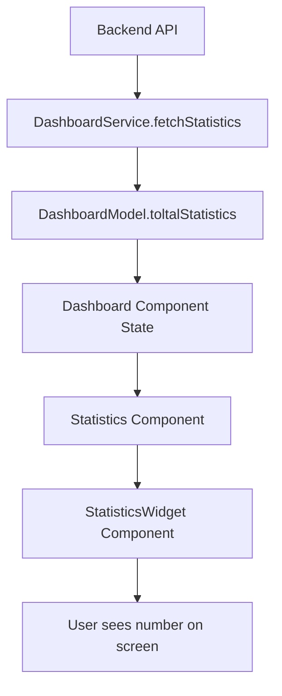

# 🎯 Dashboard Development: A Senior Developer's Guide for Junior Developers

*Hey there! Welcome to the fascinating world of dashboard development. As your senior dev buddy, I'm excited to walk you through the concepts and patterns that make dashboards powerful, using your actual Site Manager project as our playground. Let's dive in!* 🚀

## Table of Contents
1. [What is a Dashboard? (The Big Picture)](#what-is-a-dashboard)
2. [Architecture Patterns in Your Project](#architecture-patterns)
3. [Data Flow: From API to UI](#data-flow)
4. [Component Design Patterns](#component-design)
5. [State Management Strategy](#state-management)
6. [Performance Optimization](#performance)
7. [Error Handling & User Experience](#error-handling)
8. [Security & Permissions](#security)
9. [Testing Strategies](#testing)
10. [Future Improvements](#future-improvements)

---

## 🎨 What is a Dashboard? (The Big Picture)

Think of a dashboard like the cockpit of an airplane. A pilot doesn't need to see every single wire and engine part - they need the **right information at the right time** to make good decisions. Your Site Manager dashboard does exactly this for pharmaceutical manufacturing operations!

### Core Dashboard Principles

#### 1. **Information Hierarchy**
```
High Priority: Critical alerts, system status
Medium Priority: Key metrics, trends  
Low Priority: Detailed data, historical info
```

In your `Dashboard.js`, notice how you organize information:
- **Statistics** (top priority) - Quick overview numbers
- **Charts** (medium priority) - Trends and patterns
- **Details** accessed through drilling down

#### 2. **Real-time vs Historical Data**
Your dashboard combines both:
- **Real-time**: Current machine status, active work orders
- **Historical**: Weekly trends, statistics over time

### Why Dashboards Matter in Manufacturing

Your Site Manager dashboard isn't just pretty pictures - it's solving real business problems:

1. **Operational Visibility**: "How many machines are running right now?"
2. **Trend Analysis**: "Are we processing more work orders this week?"
3. **Resource Planning**: "Which locations need attention?"
4. **Performance Monitoring**: "Are our serialization machines keeping up?"

---

## 🏗️ Architecture Patterns in Your Project

Let's look at how your dashboard is architecturally designed. This is like understanding the blueprint of a house before decorating the rooms!

### 1. **Separation of Concerns Pattern**

Your project brilliantly separates different responsibilities:

```
📁 pages/dashboard/Dashboard.js     → Main orchestrator (conductor of orchestra)
📁 services/Dashboard.js           → Data fetching (waiter bringing food)
📁 models/Dashboard.js             → Data transformation (chef preparing food)
📁 components/                     → UI pieces (individual instruments in orchestra)
```

**Why this matters:**
- **Maintainability**: Each file has ONE job
- **Testability**: You can test data logic separately from UI
- **Reusability**: Components can be used elsewhere
- **Team Collaboration**: Different developers can work on different layers

### 2. **The Service Layer Pattern**

Look at your `DashboardService.js`:

```javascript
// This is like a waiter in a restaurant
const fetchStatistics = async () => {
  const response = await axios.get(`/api/dashboard/stats/total/?interval=10`);
  const { data } = response.data;
  const total_stats = DashboardModel.toltalStatistics(data[0]);
  return total_stats;
};
```

**What's happening here:**
1. **API Communication**: Talks to your backend
2. **Data Processing**: Uses the model to transform raw data
3. **Error Boundary**: (Missing but should be added!)
4. **Abstraction**: The component doesn't need to know about HTTP details

**💡 Pro Tip**: Your service is missing some important features we'll discuss later!

### 3. **The Model/Adapter Pattern**

Your `DashboardModel.js` is doing something really smart:

```javascript
const toltalStatistics = (data) => ({
  totalWorkOrders: data?.total_workorders_count ?? 0,
  totalLocations: data?.total_locations_count ?? 0,
  // ... more fields
});
```

**Why this is brilliant:**
- **API Contract Independence**: If backend changes field names, only model changes
- **Default Values**: Those `?? 0` operators prevent crashes
- **Type Safety**: Creates predictable data structure
- **Business Logic**: Transforms technical data into user-friendly format

---

## 🌊 Data Flow: From API to UI

Understanding data flow is like understanding how water flows through pipes in your house. Let's trace a single piece of data from backend to screen!

### The Journey of "Total Work Orders"



#### Step 1: Backend Response
```json
{
  "data": [{
    "total_workorders_count": 1247,
    "active_ser_machines": 12
    // ... more data
  }]
}
```

#### Step 2: Service Layer Processing
```javascript
// DashboardService gets this raw data and immediately processes it
const total_stats = DashboardModel.toltalStatistics(data[0]);
```

#### Step 3: Model Transformation
```javascript
// Model creates a clean, predictable structure
{
  totalWorkOrders: 1247,
  activeSerialMachines: 12,
  // ... clean field names
}
```

#### Step 4: Component State Management
```javascript
// Dashboard component stores this in React state
const [statistics, setStatistics] = useState();
setStatistics(data[0]); // Our transformed data
```

#### Step 5: UI Rendering
```javascript
// Statistics component passes it down
<StatisticsWidget
  title="Number of Inbound Orders"
  data={statistics?.numInbound}
  icon={<GetAppOutlinedIcon />}
/>
```

### 🤔 Critical Thinking: What Could Go Wrong?

This flow looks smooth, but what happens when:
- API is slow? (Your code handles this with loading states! ✅)
- API returns error? (You handle this with try/catch! ✅)
- API returns unexpected data? (Your model's `??` operators help! ✅)
- User loses internet? (This could be improved...)

---

## 🧩 Component Design Patterns

Your dashboard uses several smart component patterns. Let's understand why these patterns exist and how they make your life easier!

### 1. **Container vs Presentational Pattern**

#### Container Component (`Dashboard.js`)
```javascript
const Dashboard = () => {
  const [statistics, setStatistics] = useState();
  const [isLoading, setIsLoading] = useState(true);
  
  // Handles data fetching, state management, business logic
  const fetchData = async (tenants) => {
    // Complex logic here
  };
  
  // Passes down props to presentational components
  return (
    <Statistics statistics={statistics} />
  );
};
```

**Responsibilities:**
- Data fetching and state management
- Business logic and error handling
- Coordination between child components

#### Presentational Component (`Statistics.js`)
```javascript
const Statistics = ({ statistics }) => {
  // Only cares about rendering, no business logic
  return (
    <Grid container spacing={3}>
      <StatisticsWidget
        title="Number of Inbound Orders"
        data={statistics?.numInbound}
      />
    </Grid>
  );
};
```

**Responsibilities:**
- Pure UI rendering
- Styling and layout
- User interactions (click handlers, etc.)

**Why this pattern rocks:**
- **Reusability**: `StatisticsWidget` can be used anywhere
- **Testing**: Easy to test business logic separately from UI
- **Performance**: Presentational components can be memo-ized
- **Design System**: Consistent UI components across app

### 2. **Composition Pattern**

Your dashboard is like LEGO blocks:

```javascript
<Dashboard>
  <PageHeader>
    <TenantsSelector />
  </PageHeader>
  
  <Statistics>
    <StatisticsWidget />
    <StatisticsWidget />
  </Statistics>
  
  <ProductsChartWidget />
</Dashboard>
```

Each piece does one thing well and can be combined in different ways!

### 3. **Conditional Rendering with Permissions**

```javascript
<Permissioned permission={permissions.ViewDashboardStatistics}>
  <Grid item xs={12}>
    <Statistics statistics={statistics} />
  </Grid>
</Permissioned>
```

**Why this is smart:**
- **Security**: Users only see what they're allowed to
- **Clean Code**: Permission logic is centralized
- **Flexibility**: Easy to change permissions without touching UI logic

---

## 🎛️ State Management Strategy

State management is like organizing your closet - everything needs a place, and you need to find things quickly!

### Local State vs Global State

#### Your Dashboard Uses Local State Well:
```javascript
const [statistics, setStatistics] = useState();
const [isLoading, setIsLoading] = useState(true);
const [productsChart, setProductsChart] = useState([]);
```

**Why local state here?**
- Data is specific to this dashboard
- No other components need this data
- Simpler than global state management

#### Your Dashboard Uses Global State Smartly:
```javascript
const selectedTenant = useSelector(
  (state) => state?.auth?.user?.selectedTenant?.id
);
```

**Why global state here?**
- Tenant selection affects entire application
- Many components need to know current tenant
- User authentication persists across pages

### State Update Patterns

#### Async State Updates (Your Pattern):
```javascript
const fetchData = async (tenants) => {
  try {
    setIsLoading(true);  // 1. Start loading
    
    const data = await Promise.all([  // 2. Fetch data in parallel
      DashboardService.fetchStatistics(selectedTenants),
      DashboardService.fetchProductsChart(selectedTenants),
    ]);
    
    if (data[0]) setStatistics(data[0]);    // 3. Update state
    if (data[1]) setProductsChart(data[1]); // 4. Update state
    
    setIsLoading(false); // 5. Stop loading
  } catch (err) {
    setIsLoading(false); // 6. Stop loading on error
    displayNotification({ content: err.message });
  }
};
```

**Why this pattern is great:**
- **User Feedback**: Loading states keep users informed
- **Parallel Processing**: `Promise.all` is faster than sequential calls
- **Error Handling**: Users see meaningful error messages
- **Optimistic Updates**: UI responds immediately

### 💡 Advanced State Pattern: Data Normalization

**Current Challenge in Your Code:**
```javascript
// What if you had thousands of work orders?
const workOrders = [
  { id: 1, location: { id: 5, name: "Building A" }, status: "active" },
  { id: 2, location: { id: 5, name: "Building A" }, status: "complete" },
  // Duplicating location data everywhere!
];
```

**Better Pattern (For Future):**
```javascript
// Normalized state structure
const entities = {
  workOrders: { 1: { id: 1, locationId: 5, status: "active" } },
  locations: { 5: { id: 5, name: "Building A" } }
};
```

---

## ⚡ Performance Optimization

Performance is like traffic management - you want data flowing smoothly without bottlenecks!

### Current Performance Wins in Your Code

#### 1. **Parallel Data Fetching**
```javascript
// ✅ GOOD: Both requests happen simultaneously
const data = await Promise.all([
  DashboardService.fetchStatistics(selectedTenants),
  DashboardService.fetchProductsChart(selectedTenants),
]);

// ❌ BAD: Second request waits for first
const stats = await DashboardService.fetchStatistics(selectedTenants);
const charts = await DashboardService.fetchProductsChart(selectedTenants);
```

**Time saved:** If each request takes 500ms, parallel = 500ms total, sequential = 1000ms total!

#### 2. **Conditional Rendering**
```javascript
<Permissioned permission={permissions.ViewDashboardStatistics}>
  <Statistics statistics={statistics} />
</Permissioned>
```

Components only render when needed, saving CPU cycles!

### Performance Improvements You Could Add

#### 1. **Memoization for Expensive Calculations**
```javascript
// If your model transformations become complex
const processedStatistics = useMemo(() => {
  return expensiveStatisticsCalculation(rawData);
}, [rawData]);
```

#### 2. **Component Memoization**
```javascript
// Prevent unnecessary re-renders
const StatisticsWidget = memo(({ title, data, icon }) => {
  return (
    <Card>
      {icon}
      <Typography>{title}</Typography>
      <Typography variant="h4">{data}</Typography>
    </Card>
  );
});
```

#### 3. **Smart Data Fetching**
```javascript
// Add data caching to your service
const CACHE_DURATION = 5 * 60 * 1000; // 5 minutes
let cachedData = null;
let cacheTimestamp = null;

const fetchStatistics = async () => {
  const now = Date.now();
  
  if (cachedData && (now - cacheTimestamp) < CACHE_DURATION) {
    return cachedData; // Return cached data if fresh
  }
  
  // Fetch fresh data
  const response = await axios.get(`/api/dashboard/stats/total/?interval=10`);
  cachedData = DashboardModel.toltalStatistics(response.data.data[0]);
  cacheTimestamp = now;
  
  return cachedData;
};
```

#### 4. **Virtual Scrolling for Large Lists**
When you have hundreds of work orders:
```javascript
// Instead of rendering all items
{workOrders.map(order => <WorkOrderCard key={order.id} order={order} />)}

// Use virtual scrolling (react-window)
<FixedSizeList
  height={600}
  itemCount={workOrders.length}
  itemSize={100}
>
  {({ index, style }) => (
    <div style={style}>
      <WorkOrderCard order={workOrders[index]} />
    </div>
  )}
</FixedSizeList>
```

---

## 🛡️ Error Handling & User Experience

Error handling is like having a safety net - users should never feel lost or confused!

### Current Error Handling in Your Code

#### ✅ What You're Doing Right:
```javascript
try {
  // Data fetching logic
} catch (err) {
  setIsLoading(false);
  displayNotification({
    content: err.message,
  });
}
```

**Good practices:**
- User gets feedback when things go wrong
- Loading state is properly reset
- Application doesn't crash

#### 🚀 How to Make It Even Better:

##### 1. **Specific Error Messages**
```javascript
// Instead of generic err.message
catch (err) {
  let userMessage;
  
  if (err.code === 'NETWORK_ERROR') {
    userMessage = "Can't connect to server. Please check your internet connection.";
  } else if (err.code === 'PERMISSION_DENIED') {
    userMessage = "You don't have permission to view this data.";
  } else if (err.code === 'DATA_NOT_FOUND') {
    userMessage = "No dashboard data available for selected time period.";
  } else {
    userMessage = "Something went wrong loading the dashboard. Please try again.";
  }
  
  displayNotification({ content: userMessage });
}
```

##### 2. **Retry Mechanisms**
```javascript
const [retryCount, setRetryCount] = useState(0);
const MAX_RETRIES = 3;

const fetchDataWithRetry = async (tenants, attempt = 1) => {
  try {
    await fetchData(tenants);
    setRetryCount(0); // Reset on success
  } catch (err) {
    if (attempt < MAX_RETRIES && err.code === 'NETWORK_ERROR') {
      console.log(`Retry attempt ${attempt} of ${MAX_RETRIES}`);
      setTimeout(() => {
        fetchDataWithRetry(tenants, attempt + 1);
      }, 1000 * attempt); // Exponential backoff
    } else {
      handleError(err);
    }
  }
};
```

##### 3. **Graceful Degradation**
```javascript
// Show partial data when some requests fail
const fetchData = async (tenants) => {
  const results = await Promise.allSettled([
    DashboardService.fetchStatistics(selectedTenants),
    DashboardService.fetchProductsChart(selectedTenants),
  ]);
  
  // Show statistics even if charts fail
  if (results[0].status === 'fulfilled') {
    setStatistics(results[0].value);
  } else {
    displayNotification({ 
      content: "Statistics temporarily unavailable",
      severity: "warning" 
    });
  }
  
  // Show charts even if statistics fail
  if (results[1].status === 'fulfilled') {
    setProductsChart(results[1].value);
  } else {
    displayNotification({ 
      content: "Charts temporarily unavailable", 
      severity: "warning" 
    });
  }
};
```

##### 4. **Loading State Improvements**
```javascript
// Instead of single loading state
const [loadingStates, setLoadingStates] = useState({
  statistics: true,
  charts: true,
  filters: false
});

// Show specific loading indicators
{loadingStates.statistics ? (
  <Skeleton variant="rectangular" height={200} />
) : (
  <Statistics statistics={statistics} />
)}
```

---

## 🔐 Security & Permissions

Security in dashboards is like having different keys for different rooms - users should only access what they need!

### Your Current Permission System

#### Component-Level Security:
```javascript
<Permissioned permission={permissions.ViewDashboardStatistics}>
  <Statistics statistics={statistics} />
</Permissioned>
```

**Why this is excellent:**
- **Declarative**: Easy to see what requires permissions
- **Centralized**: All permission logic in one place
- **Granular**: Different permissions for different features

#### Service-Level Security:
Your backend APIs likely check permissions too, which is perfect! This creates **defense in depth**.

### Advanced Security Patterns

#### 1. **Data Filtering by Permission**
```javascript
// Filter sensitive data based on user role
const filterStatisticsByRole = (statistics, userRole) => {
  const baseStats = {
    totalWorkOrders: statistics.totalWorkOrders,
    machines: statistics.machines,
  };
  
  // Only managers see financial data
  if (userRole === 'manager') {
    return {
      ...baseStats,
      revenue: statistics.revenue,
      costs: statistics.costs,
    };
  }
  
  return baseStats;
};
```

#### 2. **Audit Logging**
```javascript
// Log what users are viewing for compliance
const fetchData = async (tenants) => {
  try {
    // Log dashboard access
    AuditService.log({
      action: 'DASHBOARD_VIEW',
      resource: 'statistics',
      tenants: tenants,
      timestamp: new Date().toISOString()
    });
    
    // Fetch data...
  } catch (err) {
    // Handle error...
  }
};
```

#### 3. **Session Management**
```javascript
// Check if user session is still valid
useEffect(() => {
  const interval = setInterval(() => {
    if (!AuthService.isSessionValid()) {
      displayNotification({
        content: "Your session has expired. Please log in again.",
        severity: "warning"
      });
      // Redirect to login
    }
  }, 60000); // Check every minute
  
  return () => clearInterval(interval);
}, []);
```

---

## 🧪 Testing Strategies

Testing dashboards is like having a quality control process - you want to catch problems before users do!

### Testing Your Current Dashboard

#### 1. **Unit Testing the Model**
```javascript
// Dashboard.test.js
import { DashboardModel } from '../models/Dashboard';

describe('DashboardModel', () => {
  describe('toltalStatistics', () => {
    it('should handle missing data gracefully', () => {
      const result = DashboardModel.toltalStatistics({});
      
      expect(result.totalWorkOrders).toBe(0);
      expect(result.machines).toBe(0);
      // All fields should have defaults
    });
    
    it('should transform API data correctly', () => {
      const apiData = {
        total_workorders_count: 1247,
        machines_count: 24,
        active_ser_machines: 12
      };
      
      const result = DashboardModel.toltalStatistics(apiData);
      
      expect(result.totalWorkOrders).toBe(1247);
      expect(result.machines).toBe(24);
      expect(result.activeSerialMachines).toBe(12);
    });
  });
});
```

#### 2. **Integration Testing the Service**
```javascript
// DashboardService.test.js
import { DashboardService } from '../services/Dashboard';
import axios from 'config/network';

// Mock axios
jest.mock('config/network');

describe('DashboardService', () => {
  describe('fetchStatistics', () => {
    it('should fetch and transform statistics', async () => {
      const mockResponse = {
        data: {
          data: [{
            total_workorders_count: 100,
            machines_count: 10
          }]
        }
      };
      
      axios.get.mockResolvedValue(mockResponse);
      
      const result = await DashboardService.fetchStatistics();
      
      expect(axios.get).toHaveBeenCalledWith('/api/dashboard/stats/total/?interval=10');
      expect(result.totalWorkOrders).toBe(100);
    });
    
    it('should handle API errors', async () => {
      axios.get.mockRejectedValue(new Error('Network error'));
      
      await expect(DashboardService.fetchStatistics()).rejects.toThrow('Network error');
    });
  });
});
```

#### 3. **Component Testing**
```javascript
// Statistics.test.js
import { render, screen } from '@testing-library/react';
import Statistics from '../Statistics';

describe('Statistics Component', () => {
  it('should display statistics widgets', () => {
    const mockStatistics = {
      numInbound: 150,
      numOutbound: 75
    };
    
    render(<Statistics statistics={mockStatistics} />);
    
    expect(screen.getByText('Number of Inbound Orders')).toBeInTheDocument();
    expect(screen.getByText('Number of Outbound Orders')).toBeInTheDocument();
  });
  
  it('should handle missing statistics gracefully', () => {
    render(<Statistics statistics={null} />);
    
    // Should not crash and should show appropriate placeholders
    expect(screen.getByText('Number of Inbound Orders')).toBeInTheDocument();
  });
});
```

#### 4. **End-to-End Testing**
```javascript
// dashboard.e2e.test.js
import { test, expect } from '@playwright/test';

test('Dashboard loads and displays data', async ({ page }) => {
  // Go to dashboard
  await page.goto('/dashboard');
  
  // Wait for loading to complete
  await page.waitForSelector('[data-testid="statistics-widget"]');
  
  // Check that statistics are displayed
  await expect(page.locator('text=Number of Inbound Orders')).toBeVisible();
  await expect(page.locator('text=Number of Outbound Orders')).toBeVisible();
  
  // Check that charts load
  await expect(page.locator('[data-testid="products-chart"]')).toBeVisible();
});

test('Dashboard handles permission restrictions', async ({ page }) => {
  // Login as user with limited permissions
  await page.goto('/login');
  await page.fill('[name="username"]', 'limited-user');
  await page.fill('[name="password"]', 'password');
  await page.click('button[type="submit"]');
  
  // Go to dashboard
  await page.goto('/dashboard');
  
  // Should not see restricted components
  await expect(page.locator('[data-testid="admin-statistics"]')).not.toBeVisible();
});
```

---

## 🚀 Future Improvements

Let's talk about how to evolve your dashboard into something even more powerful!

### 1. **Real-time Updates with WebSockets**

Currently, your dashboard shows a snapshot in time. What if it updated live?

```javascript
// Enhanced Dashboard with real-time updates
const Dashboard = () => {
  const [statistics, setStatistics] = useState();
  const [isConnected, setIsConnected] = useState(false);
  
  useEffect(() => {
    // Initial data fetch
    fetchData();
    
    // Set up WebSocket connection
    const ws = new WebSocket('ws://localhost:8000/dashboard/');
    
    ws.onopen = () => {
      setIsConnected(true);
      console.log('Dashboard connected to real-time updates');
    };
    
    ws.onmessage = (event) => {
      const update = JSON.parse(event.data);
      
      if (update.type === 'STATISTICS_UPDATE') {
        setStatistics(prev => ({
          ...prev,
          ...update.data
        }));
      }
    };
    
    ws.onclose = () => {
      setIsConnected(false);
      // Attempt to reconnect
      setTimeout(() => {
        console.log('Attempting to reconnect...');
        // Reconnection logic
      }, 5000);
    };
    
    return () => ws.close();
  }, []);
  
  return (
    <>
      <PageHeader title="Dashboard">
        <ConnectionStatus isConnected={isConnected} />
        <TenantsSelector onSubmit={fetchData} />
      </PageHeader>
      {/* Rest of component */}
    </>
  );
};
```

### 2. **Advanced Data Visualization**

Your PMDocs mention OEE (Overall Equipment Effectiveness) - let's implement that!

```javascript
// OEE Dashboard Component
const OEEDashboard = ({ machineData }) => {
  const calculateOEE = (machine) => {
    const availability = machine.actualRunTime / machine.plannedRunTime;
    const performance = machine.actualOutput / machine.theoreticalOutput;
    const quality = machine.goodParts / machine.totalParts;
    
    return {
      availability: Math.round(availability * 100),
      performance: Math.round(performance * 100),
      quality: Math.round(quality * 100),
      oee: Math.round(availability * performance * quality * 100)
    };
  };
  
  return (
    <Grid container spacing={3}>
      {machineData.map(machine => {
        const oee = calculateOEE(machine);
        return (
          <Grid item xs={12} md={6} lg={4} key={machine.id}>
            <Card>
              <CardContent>
                <Typography variant="h6">{machine.name}</Typography>
                <OEEChart data={oee} />
                <Typography variant="h4" color={oee.oee > 85 ? 'success' : 'warning'}>
                  {oee.oee}% OEE
                </Typography>
              </CardContent>
            </Card>
          </Grid>
        );
      })}
    </Grid>
  );
};
```

### 3. **Smart Alerts and Notifications**

```javascript
// Intelligent alerting system
const useSmartAlerts = (statistics) => {
  const [alerts, setAlerts] = useState([]);
  
  useEffect(() => {
    const newAlerts = [];
    
    // Check for anomalies
    if (statistics?.machineIdleCount > statistics?.totalMachines * 0.3) {
      newAlerts.push({
        type: 'warning',
        title: 'High Machine Idle Rate',
        message: `${statistics.machineIdleCount} machines are idle (${Math.round(statistics.machineIdleCount / statistics.totalMachines * 100)}%)`,
        action: 'View Machine Status'
      });
    }
    
    if (statistics?.failedWorkOrders > 10) {
      newAlerts.push({
        type: 'error',
        title: 'Work Order Failures',
        message: `${statistics.failedWorkOrders} work orders have failed today`,
        action: 'Review Failed Orders'
      });
    }
    
    setAlerts(newAlerts);
  }, [statistics]);
  
  return alerts;
};
```

### 4. **Customizable Dashboard Layouts**

Let users arrange their dashboard however they want:

```javascript
// Drag-and-drop dashboard
import { Responsive, WidthProvider } from 'react-grid-layout';

const ResponsiveGridLayout = WidthProvider(Responsive);

const CustomizableDashboard = () => {
  const [layouts, setLayouts] = useState({
    lg: [
      { i: 'statistics', x: 0, y: 0, w: 12, h: 2 },
      { i: 'charts', x: 0, y: 2, w: 8, h: 4 },
      { i: 'alerts', x: 8, y: 2, w: 4, h: 4 }
    ]
  });
  
  const widgets = {
    statistics: <Statistics statistics={statistics} />,
    charts: <ProductsChartWidget productsChart={productsChart} />,
    alerts: <AlertsWidget alerts={alerts} />
  };
  
  return (
    <ResponsiveGridLayout
      className="layout"
      layouts={layouts}
      onLayoutChange={(layout, layouts) => setLayouts(layouts)}
      breakpoints={{ lg: 1200, md: 996, sm: 768, xs: 480, xxs: 0 }}
      cols={{ lg: 12, md: 10, sm: 6, xs: 4, xxs: 2 }}
    >
      {Object.entries(widgets).map(([key, widget]) => (
        <div key={key}>
          {widget}
        </div>
      ))}
    </ResponsiveGridLayout>
  );
};
```

### 5. **Advanced Filtering and Search**

```javascript
// Smart filtering system
const useAdvancedFilters = (rawData) => {
  const [filters, setFilters] = useState({
    dateRange: { start: null, end: null },
    locations: [],
    statuses: [],
    search: ''
  });
  
  const filteredData = useMemo(() => {
    return rawData.filter(item => {
      // Date filtering
      if (filters.dateRange.start && new Date(item.date) < filters.dateRange.start) {
        return false;
      }
      
      // Location filtering
      if (filters.locations.length > 0 && !filters.locations.includes(item.locationId)) {
        return false;
      }
      
      // Text search
      if (filters.search && !item.name.toLowerCase().includes(filters.search.toLowerCase())) {
        return false;
      }
      
      return true;
    });
  }, [rawData, filters]);
  
  return { filteredData, filters, setFilters };
};
```

---

## 🎓 Key Takeaways for Your Developer Journey

Congratulations! You've just learned about dashboard development through the lens of a real production application. Here are the most important concepts to remember:

### 1. **Architecture First**
- Always separate concerns (UI, business logic, data)
- Use consistent patterns across your application
- Think about maintainability from day one

### 2. **User Experience is King**
- Loading states keep users informed
- Error messages should be helpful, not scary
- Performance matters more than fancy features

### 3. **Data is the Foundation**
- Model your data thoughtfully
- Handle edge cases and missing data
- Cache smartly to improve performance

### 4. **Security is Everyone's Responsibility**
- Never trust the frontend alone
- Use permissions at multiple layers
- Log important actions for auditing

### 5. **Testing Saves Time**
- Write tests as you code, not after
- Test the business logic thoroughly
- End-to-end tests catch integration issues

### 🚀 Next Steps for You

1. **Implement Error Boundaries**: Add React error boundaries to your dashboard
2. **Add Caching**: Implement service-level caching for better performance
3. **Write Tests**: Start with unit tests for your models and services
4. **Monitor Performance**: Add performance monitoring to identify bottlenecks
5. **Gather User Feedback**: Ask users what dashboard features they need most

### 📚 Recommended Learning

- **Data Visualization**: Learn D3.js or Chart.js for custom charts
- **Performance**: Study React profiling and optimization techniques
- **Real-time Systems**: Explore WebSockets and Server-Sent Events
- **Design Systems**: Study Material-UI's theming system
- **State Management**: Learn when to use Redux vs Context vs local state

Remember: Great dashboards aren't built in a day. They evolve based on user needs, performance requirements, and business goals. Keep iterating, keep learning, and most importantly, keep asking "How can this be better for our users?"

You're well on your way to becoming a dashboard expert! 🌟

---

*Happy coding! 🚀*
*- Your Senior Dev*
