# 📚 Junior Developer Study Guide: React Components & Props Management

## 🎯 **What We Built: ERP Fetch Component**

We created a reusable component that allows users to fetch work order data from external ERP systems before creating a new work order.

### **Final Architecture:**
```
AddWorkOrder (Parent)
├── PageHeader
├── FetchFromERP (Child Component) ← What we built
│   ├── Work Order Input Field
│   ├── ERP Source Dropdown  
│   └── Fetch Button
└── AddWorkOrderForm (Main Form)
```

---

# 🔐 **Implementing First Login Flow: A Complete Authentication Enhancement**

## 🎯 **What We Built: First Login Password Reset System**

We implemented a secure first-login flow that forces new users to reset their password before accessing the application, with complete navigation restrictions during the process.

### **Final Architecture:**
```
Login Flow
├── Login Component (Enhanced)
│   ├── Backend Response Processing
│   ├── First Login Detection
│   └── Conditional Navigation
├── Redux State Management (Enhanced)
│   ├── isFirstLogin Flag
│   └── State Persistence
├── AdminLayout (Enhanced)
│   ├── Navigation Detection
│   └── Drawer Restrictions
├── ResetPassword Component (Enhanced)
│   ├── First Login Mode
│   ├── Enhanced UX
│   └── Smart Navigation
└── Navigation Components (Enhanced)
    ├── MiniDrawer
    ├── CustomDrawer
    └── Conditional Rendering
```

---

## 🏗️ **Key Concept 1: Component Separation**

### **Problem We Solved:**
- **Before:** Button in header, logic mixed with form, hard to maintain
- **After:** Dedicated component, clear responsibility, reusable

### **Benefits of Separate Components:**
- ✅ **Single Responsibility**: Each component has one job
- ✅ **Reusability**: Can use FetchFromERP in other pages
- ✅ **Maintainability**: Easy to find and fix issues
- ✅ **Testing**: Can test each part independently

### **Real-World Application:**
```javascript
// ✅ Good - Separate components
<Header />
<FetchFromERP />
<MainForm />

// ❌ Bad - Everything in one component
<MegaComponent /> // Does header, fetch, form, everything
```

---

## 🎮 **Key Concept 2: Controlled vs Uncontrolled Components**

### **Simple Analogy:**
- **Controlled** = Wired game controller (console controls everything)
- **Uncontrolled** = Wireless controller with memory (controller remembers itself)

### **Controlled Components (What We Used):**
```javascript
// React manages the state
const [value, setValue] = useState("");

<input 
  value={value}                    // ← React controls current value
  onChange={(e) => setValue(e.target.value)} // ← Every change updates React
/>
```

**Characteristics:**
- React state controls the value
- Re-renders on every change
- Always know current value
- Good for real-time validation

### **Uncontrolled Components:**
```javascript
// Component manages its own state
const inputRef = useRef();

<input 
  defaultValue="initial"  // ← Only sets initial value
  ref={inputRef}         // ← Access via reference when needed
/>

// Get value later:
const currentValue = inputRef.current.value;
```

**Characteristics:**
- Component manages itself
- No re-renders on change
- Need to query for current value
- Better performance for simple cases

### **When to Use Each:**
| Use Controlled When | Use Uncontrolled When |
|-------------------|---------------------|
| Real-time validation | Simple forms |
| Dynamic behavior | Performance critical |
| Instant feedback | One-time data entry |
| State sharing needed | Legacy integration |

---

## 📡 **Key Concept 3: Props Management & Data Flow**

### **The Props Pattern We Used:**

#### **Data Props (Parent → Child):**
```javascript
// Parent sends data down
<FetchFromERP 
  workOrderSourceOptions={formOptions.work_order_source} // ← Data flows down
  selectedSource={selectedWorkOrderSource}              // ← Current state flows down
/>
```

#### **Callback Props (Child → Parent):**
```javascript
// Parent provides functions for child to call
<FetchFromERP 
  onSourceChange={handleSourceChange}  // ← Child calls when selection changes
  onFetchClick={handleFetchFromERP}    // ← Child calls when button clicked
/>
```

### **Data Flow Diagram:**
```
1. Parent State → Child Props → User sees data
2. User Interaction → Child Event → Parent Callback → Parent State Update
3. Parent State Update → Child Props → User sees change
```

### **Props Best Practices:**
```javascript
// ✅ Good - Descriptive names, defaults provided
const FetchFromERP = ({
  workOrderSourceOptions = [],     // Clear purpose, safe default
  selectedSource = null,           // Clear null state
  onSourceChange = () => {},       // Prevents crashes
  onFetchClick = () => {},         
  isLoading = false,
  title = "Fetch from ERP"
}) => {
  // Component logic
};

// ❌ Bad - Unclear names, no defaults
const FetchFromERP = ({ options, value, onChange, onClick }) => {
  // What do these props do? What if they're undefined?
};
```

---

## ⚡ **Key Concept 4: Event Handling Differences**

### **The Confusion We Solved:**

#### **TextField (Native HTML Pattern):**
```javascript
<TextField onChange={(event) => {
    // Must extract value from event object
    onWorkOrderChange(event.target.value);
}} />
```

**Why?** TextField wraps native HTML input, follows DOM standards.

#### **Autocomplete (Custom Component Pattern):**
```javascript
<Autocomplete onChange={(event, newValue) => {
    // Value provided directly as parameter
    onSourceChange(newValue);
}} />
```

**Why?** Autocomplete is complex, does processing internally, gives you clean data.

### **How to Remember:**
- **Simple HTML-like components** → Use `event.target.value`
- **Complex custom components** → Use direct parameters

### **Event Object Structure:**
```javascript
// What's inside the event object:
{
  target: HTMLInputElement,  // The DOM element
  type: "change",           // Event type
  currentTarget: ...,       // Element with listener
  preventDefault: fn,       // Prevent default behavior
  // ... many more properties
}

// What we usually want:
event.target.value  // The current input value
```

---

## 🔄 **Key Concept 5: Component Lifecycle & State Management**

### **Our Component's Lifecycle:**

#### **1. Initial Mount:**
```javascript
useEffect(() => {
  fetchData(); // Load ERP sources from API
}, []); // Empty dependency array = run once on mount
```

#### **2. State Updates:**
```javascript
const [selectedSource, setSelectedSource] = useState(null);

// When user selects something:
const handleSourceChange = (newSource) => {
  setSelectedSource(newSource); // This triggers re-render
};
```

#### **3. Re-render Triggers:**
- Parent state changes
- Props change
- Internal state changes
- Context changes

### **State Management Patterns:**

#### **Local State (useState):**
```javascript
const [localData, setLocalData] = useState(initial);
// Use for: Component-specific data that doesn't need to be shared
```

#### **Lifted State:**
```javascript
// State in parent, shared with children via props
const Parent = () => {
  const [sharedData, setSharedData] = useState(initial);
  return (
    <Child1 data={sharedData} onChange={setSharedData} />
    <Child2 data={sharedData} />
  );
};
```

---

## 🎨 **Key Concept 6: Component Design Principles**

### **Single Responsibility Principle:**
```javascript
// ✅ Good - Each component has one job
const FetchFromERP = () => { /* Handle ERP fetching */ };
const WorkOrderForm = () => { /* Handle form creation */ };
const PageHeader = () => { /* Handle page title/navigation */ };

// ❌ Bad - One component does everything
const MegaComponent = () => { 
  /* Handles header, fetching, form, validation, API calls, etc. */ 
};
```

### **Props Interface Design:**
```javascript
// ✅ Good - Clear, predictable interface
interface Props {
  // Data props
  options: Array<Option>;
  selectedValue: Option | null;
  
  // Behavior props  
  onChange: (value: Option) => void;
  onSubmit: (data: FormData) => void;
  
  // Configuration props
  isLoading?: boolean;
  title?: string;
}

// ❌ Bad - Unclear, unpredictable
interface Props {
  data: any;
  callback: Function;
  config: Object;
}
```

---

## 🧪 **Key Concept 7: Debugging & Problem Solving**

### **Common Issues We Encountered & Solutions:**

#### **Issue 1: `setFieldValue is not a function`**
**Problem:** Used Formik-specific component outside Formik context
**Solution:** Use base Material-UI components directly
**Lesson:** Check component dependencies and context requirements

#### **Issue 2: Event handling confusion**
**Problem:** Using wrong pattern for different component types
**Solution:** Check component documentation for onChange signature
**Lesson:** Different components handle events differently

#### **Issue 3: Props not updating**
**Problem:** Component not re-rendering when expected
**Solution:** Check if props are actually changing, verify dependencies
**Lesson:** React only re-renders when state/props actually change

### **Debugging Techniques:**
```javascript
// 1. Console.log everything
const MyComponent = (props) => {
  console.log("Props received:", props);
  console.log("Current state:", state);
  
  const handleChange = (value) => {
    console.log("Change triggered with:", value);
    setState(value);
  };
};

// 2. React Developer Tools
// Install browser extension to inspect component tree

// 3. Check prop types
MyComponent.propTypes = {
  data: PropTypes.array.isRequired,
  onChange: PropTypes.func.isRequired
};
```

---

## 🔧 **Practical Exercises for Reinforcement**

### **Exercise 1: Create a Reusable Search Component**
```javascript
// Create a component that:
// 1. Takes search options as props
// 2. Has controlled input field
// 3. Calls parent callback on selection
// 4. Shows loading state

const SearchComponent = ({
  options,
  onSearch,
  isLoading,
  placeholder
}) => {
  // Your implementation here
};
```

### **Exercise 2: Fix Event Handling**
```javascript
// Fix these event handlers:

// TextField - what's wrong?
<TextField onChange={(newValue) => {
  setValue(newValue); // ❌ Wrong!
}} />

// Autocomplete - what's wrong?  
<Autocomplete onChange={(event) => {
  setValue(event.target.value); // ❌ Wrong!
}} />
```

### **Exercise 3: Props Debugging**
```javascript
// This component isn't updating. Why?
const BrokenComponent = ({ data }) => {
  const [items, setItems] = useState(data);
  
  // Items never update when data prop changes!
  // How would you fix this?
  
  return <div>{items.map(item => <p>{item}</p>)}</div>;
};
```

---

## 📖 **Study Checklist**

### **Concepts to Master:**
- [ ] Difference between controlled and uncontrolled components
- [ ] When to lift state up vs keep it local
- [ ] How props flow from parent to child
- [ ] How callbacks flow from child to parent  
- [ ] Event handling differences between component types
- [ ] Component lifecycle and useEffect
- [ ] Debugging techniques for React components

### **Practical Skills:**
- [ ] Create reusable components with clear prop interfaces
- [ ] Handle different types of form inputs correctly
- [ ] Debug props and state issues
- [ ] Structure component hierarchies logically
- [ ] Write components that are easy to test

### **Code Review Questions to Ask:**
- [ ] Is this component doing too many things?
- [ ] Are the props clearly named and documented?
- [ ] Is the state managed at the right level?
- [ ] Are we handling events correctly for this component type?
- [ ] Would this component be easy to test?
- [ ] Is the data flow predictable and easy to trace?

---

## 🚀 **Next Steps**

### **Advanced Topics to Explore:**
1. **Context API** - For deeply nested prop passing
2. **useReducer** - For complex state logic
3. **Custom Hooks** - For reusable stateful logic
4. **React.memo** - For performance optimization
5. **Error Boundaries** - For error handling
6. **Testing** - Unit tests for components

### **Resources:**
- React Documentation: https://react.dev
- Material-UI Documentation: https://mui.com
- React Developer Tools (Browser Extension)
- JavaScript.info (For JS fundamentals)

Remember: **Practice makes perfect!** Try building small components on your own to reinforce these concepts.

## 🏗️ **Key Problem We Solved**

### **The Challenge:**
- **Security Risk**: New users were accessing the system with default passwords
- **Poor UX**: No clear indication that password change was required
- **Navigation Issues**: Users could navigate away from password reset
- **Inconsistent State**: App didn't track first login status properly

### **Our Solution:**
1. ✅ **Secure Flow**: Force password reset before any system access
2. ✅ **Clear UX**: Visual indicators and helpful messaging
3. ✅ **Restricted Navigation**: Completely disable drawer during first login
4. ✅ **State Management**: Proper Redux integration for first login tracking

---

## 📊 **State Management: Redux Pattern**

### **Enhanced Auth Slice:**

```javascript
// src/redux/slices/authSlice.js
const initialState = {
  isLoggedIn: false,
  token: null,
  refreshToken: null,
  user: null,
  isFirstLogin: false, // ← New state property
};

const authSlice = createSlice({
  name: "auth",
  initialState,
  reducers: {
    updateUserData(state, action) {
      const { token, user, isLoggedIn, refreshToken, isFirstLogin } = action.payload;
      // ... existing logic ...
      state.isFirstLogin = isFirstLogin !== undefined ? isFirstLogin : false;
    },
    logOut(state) {
      // ... existing logout logic ...
      state.isFirstLogin = false; // ← Reset on logout
    },
  },
});
```

### **Why This Pattern:**
- **Centralized State**: Single source of truth for authentication status
- **Predictable Updates**: Clear reducers for state changes
- **Persistence**: State survives component re-renders
- **Accessibility**: Any component can access auth state via useSelector

---

## 🔄 **Login Flow Enhancement**

### **Enhanced Login Component:**

```javascript
// src/pages/login/Login.js
const handleLogin = useCallback(
  async (username, password) => {
    setError(null);
    try {
      const result = await GlobalService.login(username, password);
      
      // 🔍 Critical: Check first_login flag from backend
      const isFirstLogin = result.user.first_login === true;
      
      dispatch(
        updateUserData({
          isLoggedIn: true,
          token: result?.tokens.access,
          tokenExpiry: result?.tokens.access_expires_in,
          refreshToken: result?.tokens.refresh,
          refreshTokenExpiry: result?.tokens.refresh_expires_in,
          user: result.user,
          isFirstLogin: isFirstLogin, // ← Pass to Redux
        })
      );
      
      displayNotification({
        content: t("Welcome Back"),
        severity: "success",
      });
      
      // 🚀 Smart Navigation Based on First Login Status
      if (isFirstLogin) {
        // First time user must reset password
        navigate("/reset-password?first-login=true");
      } else {
        // Regular user goes to home
        navigate("/home");
      }
    } catch (err) {
      setError(err.message || t("Login failed"));
    }
  },
  [dispatch, displayNotification, navigate, t]
);
```

### **Key Learning Points:**

#### **1. Backend Data Processing:**
```javascript
// ✅ Proper boolean checking
const isFirstLogin = result.user.first_login === true;

// ❌ Potential issues:
const isFirstLogin = result.user.first_login; // Could be undefined, null, or string
```

#### **2. Query Parameter Pattern:**
```javascript
navigate("/reset-password?first-login=true");
// Later accessed via: location.search.includes("first-login=true")
```

#### **3. Conditional Navigation:**
```javascript
// Different flows for different user types
if (isFirstLogin) {
  navigate("/reset-password?first-login=true");
} else {
  navigate("/home");
}
```

---

## 🔒 **Navigation Restriction Pattern**

### **AdminLayout Enhancement:**

```javascript
// src/layouts/AdminLayout.js
const AdminLayout = ({children}) => {
    const location = useLocation();
    const isFirstLogin = useSelector((state) => state?.auth?.isFirstLogin);
    
    // 🔍 Detect if we're in first login reset password flow
    const isOnFirstLoginResetPassword = 
        location.pathname === "/reset-password" && 
        location.search.includes("first-login=true") && 
        isFirstLogin;
    
    return (
        <Box sx={{display: 'flex'}}>
            <MiniDrawer
                history={history}
                children={children}
                drawerWidth={drawerWidth}
                navigationDisabled={isOnFirstLoginResetPassword} // ← Pass restriction down
            />
            {/* ... rest of layout ... */}
        </Box>
    );
};
```

### **Prop Drilling Pattern:**
```
AdminLayout
├── navigationDisabled → MiniDrawer
    ├── navigationDisabled → CustomAppBar
    └── navigationDisabled → CustomDrawer
```

### **CustomDrawer Enhancement:**
```javascript
// src/layouts/components/CustomDrawer.js
const CustomDrawer = ({ open, handleDrawerClose, navigationDisabled = false }) => {
    return (
        <Drawer variant="permanent" open={open && !navigationDisabled}>
            <CustomDrawerHeader 
                handleDrawerClose={handleDrawerClose} 
                navigationDisabled={navigationDisabled}
            />
            {/* 🔒 Conditionally render navigation items */}
            {!navigationDisabled && (
                <>
                    <Divider />
                    <List>
                        {MenuItems?.map((item) => (
                            <DrawerEntry key={item.id} item={item} />
                        ))}
                    </List>
                    {/* ... footer ... */}
                </>
            )}
        </Drawer>
    );
};
```

---

## 🎨 **Enhanced UX Patterns**

### **Smart Reset Password Component:**

```javascript
// src/pages/reset-password/ResetPassword.js
const ResetPassword = () => {
  const location = useLocation();
  const isFirstLogin = useSelector((state) => state?.auth?.isFirstLogin);
  
  // 🔍 Detect first login flow
  const isFirstLoginFlow = location.search.includes("first-login=true") && isFirstLogin;

  const handleSubmit = async (values, { setErrors, setStatus, setSubmitting }) => {
    // ... password reset logic ...
    
    try {
      const result = await UsersService.resetPassword(body);
      if (result) {
        if (isFirstLoginFlow) {
          // 🎯 First login: Clear flag and continue to app
          displayNotification({
            content: t("Password changed successfully! Welcome to the system."),
            severity: "success",
          });
          
          dispatch(updateUserData({ 
            ...userData, 
            isFirstLogin: false // ← Clear the flag
          }));
          
          navigate("/home");
        } else {
          // 🚪 Regular reset: Logout and return to login
          displayNotification({
            content: t("Password Changed, Please Login in"),
            severity: "success",
          });

          dispatch(logOut());
          navigate("/");
        }
      }
    } catch (e) {
      // ... error handling ...
    }
  };

  return (
    <>
      <PageHeader 
        title='Reset Password' 
        showBackButton={!isFirstLoginFlow} // ← Hide back button for first login
      />

      {/* 📢 First Login Alert */}
      {isFirstLoginFlow && (
        <Box sx={{ px: 2, mb: 2 }}>
          <Alert severity="info" sx={{ maxWidth: 500, mx: "auto" }}>
            <Typography variant="body2">
              {t("Welcome! This is your first login. Please create a new password to continue using the system.")}
            </Typography>
          </Alert>
        </Box>
      )}

      {/* ... rest of component with conditional messaging ... */}
    </>
  );
};
```

---

## 🧠 **Advanced Concepts Explained**

### **1. Conditional Rendering Patterns:**

```javascript
// ✅ Good - Clear conditional rendering
{isFirstLoginFlow && (
  <Alert severity="info">
    First login message
  </Alert>
)}

// ✅ Good - Ternary for different content
{isFirstLoginFlow 
  ? t("Create your new password")
  : t("Please enter your new passwords")
}

// ❌ Avoid - Complex nested conditions
{isFirstLogin && location.search.includes("first-login") && user && (
  <ComplexComponent />
)}
```

### **2. State Synchronization:**

```javascript
// ✅ Good - Clear state updates
dispatch(updateUserData({ 
  ...userData, 
  isFirstLogin: false 
}));

// ❌ Bad - Direct state mutation
state.isFirstLogin = false; // This won't work in Redux
```

### **3. URL Parameter Patterns:**

```javascript
// ✅ Good - Descriptive parameters
navigate("/reset-password?first-login=true");

// ✅ Good - Safe parameter checking
const isFirstLoginFlow = location.search.includes("first-login=true") && isFirstLogin;

// ❌ Bad - Unclear parameters
navigate("/reset-password?fl=1");
```

---

## 🚨 **Common Pitfalls & Solutions**

### **Pitfall 1: Race Conditions**
```javascript
// ❌ Problem: State might not be updated yet
const isFirstLogin = useSelector((state) => state?.auth?.isFirstLogin);
if (isFirstLogin) {
  // This might run before state is updated
}

// ✅ Solution: Use URL parameters as backup
const isFirstLoginFlow = location.search.includes("first-login=true") && isFirstLogin;
```

### **Pitfall 2: Navigation Loops**
```javascript
// ❌ Problem: Infinite redirects
useEffect(() => {
  if (isFirstLogin) {
    navigate("/reset-password");
  }
}, [isFirstLogin]); // Runs every time isFirstLogin changes

// ✅ Solution: Use callback in login handler
if (isFirstLogin) {
  navigate("/reset-password?first-login=true");
}
```

### **Pitfall 3: State Persistence Issues**
```javascript
// ❌ Problem: State lost on refresh
const [isFirstLogin, setIsFirstLogin] = useState(false);

// ✅ Solution: Use Redux with persistence
const isFirstLogin = useSelector((state) => state?.auth?.isFirstLogin);
```

---

## 🪟 **Alternative Approach: Modal/Popup Implementation**

Since understanding different approaches is crucial for a junior developer, let's explore how we could implement the same functionality using a modal/popup approach.

### **Modal Implementation Architecture:**
```
Login Component
├── Login Form
├── Success Handler
└── ResetPasswordModal (Conditional)
    ├── Modal Dialog
    ├── Password Form (Duplicate Logic)
    ├── Validation
    └── Submit Handler
```

### **Step 1: Create the Reset Password Modal Component**

```javascript
// src/components/ResetPasswordModal.js
import React from "react";
import * as Yup from "yup";
import { Formik } from "formik";
import { useTranslation } from "react-i18next";
import CustomButton from "components/CustomButton";
import CustomTextField from "components/CustomTextField";
import {
  Dialog,
  DialogTitle,
  DialogContent,
  DialogActions,
  Grid,
  Typography,
  Box,
  Divider,
  IconButton,
  Alert,
} from "@mui/material";
import CloseIcon from "@mui/icons-material/Close";
import { UsersService } from "services/UsersService";
import { useNotificationAndBackdrop } from "hooks/useNotificationAndBackdrop";

const initialValues = {
  new_password: "",
  confirm_new_password: "",
};

const ResetPasswordModal = ({ 
  open, 
  userData, 
  onSuccess, 
  onCancel,
  disableClose = true // For first login, prevent closing
}) => {
  const { t } = useTranslation();
  const { displayNotification } = useNotificationAndBackdrop();

  const Validation = Yup.object().shape({
    new_password: Yup.string()
      .min(8, "Must be 8 characters or more")
      .matches(/\d+/, "At least one number")
      .required(t("Required")),
    confirm_new_password: Yup.string()
      .oneOf([Yup.ref("new_password"), null], "Passwords do not match")
      .required(t("Required")),
  });

  const handleSubmit = async (
    values,
    { setErrors, setStatus, setSubmitting }
  ) => {
    const body = {
      ...values,
      id_user_to_change_password: userData?.id_user,
    };

    try {
      const result = await UsersService.resetPassword(body);
      if (result) {
        displayNotification({
          content: t("Password changed successfully! Welcome to the system."),
          severity: "success",
        });
        onSuccess(); // Call parent success handler
      }

      setStatus({ success: true });
      setSubmitting(false);
    } catch (e) {
      setStatus({ success: false });
      setErrors({ submit: e.message });
      setSubmitting(false);
    }
  };

  return (
    <Dialog
      open={open}
      onClose={disableClose ? undefined : onCancel}
      fullWidth
      maxWidth="sm"
      disableEscapeKeyDown={disableClose}
      // Prevent closing by clicking outside for first login
      PaperProps={{
        onClick: (e) => e.stopPropagation(),
      }}
      BackdropProps={{
        onClick: disableClose ? (e) => e.preventDefault() : onCancel,
      }}
    >
      <DialogTitle>
        <Box display="flex" justifyContent="space-between" alignItems="center">
          <Typography variant="h6">
            {t("Password Reset Required")}
          </Typography>
          {!disableClose && (
            <IconButton onClick={onCancel} size="small">
              <CloseIcon />
            </IconButton>
          )}
        </Box>
      </DialogTitle>

      <DialogContent>
        {/* First Login Alert */}
        <Alert severity="info" sx={{ mb: 2 }}>
          <Typography variant="body2">
            {t("This is your first login. Please set a new password to continue.")}
          </Typography>
        </Alert>

        {/* User Info */}
        <Box sx={{ mb: 2, textAlign: "center" }}>
          <Typography variant="h6" color="textPrimary" sx={{ fontWeight: 500 }}>
            {`${userData?.first_name} ${userData?.last_name}`}
          </Typography>
          <Typography variant="body2" color="textSecondary" sx={{ mt: 0.5 }}>
            {t("Create your new password")}
          </Typography>
        </Box>

        <Divider sx={{ mb: 2 }} />

        {/* Password Form */}
        <Formik
          onSubmit={handleSubmit}
          validationSchema={Validation}
          initialValues={{ ...initialValues }}
        >
          {({
            values,
            errors,
            touched,
            handleBlur,
            handleChange,
            handleSubmit,
            isSubmitting,
          }) => (
            <form noValidate onSubmit={handleSubmit}>
              <Grid container spacing={2}>
                {/* New Password */}
                <Grid item xs={12}>
                  <CustomTextField
                    fullWidth
                    required
                    type="password"
                    id="new_password"
                    onBlur={handleBlur}
                    title="New Password"
                    onChange={handleChange}
                    error={errors?.new_password}
                    value={values?.new_password}
                    touched={touched?.new_password}
                  />
                </Grid>

                {/* Confirm New Password */}
                <Grid item xs={12}>
                  <CustomTextField
                    fullWidth
                    required
                    type="password"
                    id="confirm_new_password"
                    onBlur={handleBlur}
                    onChange={handleChange}
                    title="Confirm Password"
                    error={errors?.confirm_new_password}
                    value={values?.confirm_new_password}
                    touched={touched?.confirm_new_password}
                  />
                </Grid>

                {/* Submission error */}
                {errors.submit && (
                  <Grid item xs={12}>
                    <Typography
                      variant="body2"
                      color="error"
                      align="center"
                      sx={{ mt: 1 }}
                    >
                      {errors.submit}
                    </Typography>
                  </Grid>
                )}
              </Grid>

              <DialogActions sx={{ justifyContent: "center", mt: 3, gap: 2 }}>
                {!disableClose && (
                  <CustomButton
                    variant="outlined"
                    title="Cancel"
                    onClick={onCancel}
                  />
                )}
                <CustomButton
                  type="submit"
                  title="Update Password"
                  isDisabled={isSubmitting}
                />
              </DialogActions>
            </form>
          )}
        </Formik>
      </DialogContent>
    </Dialog>
  );
};

export default ResetPasswordModal;
```

### **Step 2: Enhanced Login Component with Modal**

```javascript
// src/pages/login/Login.js (Modal approach)
import React, { useMemo, useState, useCallback } from "react";
import { Box } from "@mui/material";
import LoginPanel from "./components/LoginPanel";
import LocalizationIcon from "components/LocalizationIcon";
import { useDispatch } from "react-redux";
import { updateUserData } from "redux/slices/authSlice";
import { useNotificationAndBackdrop } from "hooks/useNotificationAndBackdrop";
import { useTranslation } from "react-i18next";
import ThemeColors from "../../config/colors";
import { useNavigate } from "react-router-dom";
import { GlobalService } from "services/GlobalService";
import ResetPasswordModal from "components/ResetPasswordModal";

const Login = React.memo(() => {
  const [error, setError] = useState(null);
  const [showResetPasswordModal, setShowResetPasswordModal] = useState(false);
  const [loginUserData, setLoginUserData] = useState(null);
  const dispatch = useDispatch();
  const { t } = useTranslation();
  const { displayNotification } = useNotificationAndBackdrop();
  const navigate = useNavigate();

  // ... existing backgroundStyles ...

  // Handle login, dispatch user data, and check for first login
  const handleLogin = useCallback(
    async (username, password) => {
      setError(null);
      try {
        const result = await GlobalService.login(username, password);
        
        // Store user data for potential modal usage
        setLoginUserData(result.user);
        
        // Always dispatch user data for authentication
        dispatch(
          updateUserData({
            isLoggedIn: true,
            token: result?.tokens.access,
            tokenExpiry: result?.tokens.access_expires_in,
            refreshToken: result?.tokens.refresh,
            refreshTokenExpiry: result?.tokens.refresh_expires_in,
            user: result.user,
          })
        );

        displayNotification({
          content: t("Welcome Back"),
          severity: "success",
        });

        // 🔍 Check if this is the first login
        if (result.user.first_login === true) {
          // Show modal for password reset
          setShowResetPasswordModal(true);
        } else {
          // Regular navigation for returning users
          navigate("/home");
        }
      } catch (err) {
        setError(err.message || t("Login failed"));
      }
    },
    [dispatch, displayNotification, navigate, t]
  );

  // Handle successful password reset from modal
  const handlePasswordResetSuccess = useCallback(() => {
    setShowResetPasswordModal(false);
    // Navigate to home after successful password reset
    navigate("/home");
  }, [navigate]);

  // Handle modal cancellation (for first login, this could log them out)
  const handlePasswordResetCancel = useCallback(() => {
    setShowResetPasswordModal(false);
    // For first login, you might want to log them out
    // dispatch(logOut());
    // navigate("/");
    
    // Or just keep them on login screen
    setError(t("Password reset is required for first login"));
  }, [t]);

  return (
    <Box
      display='flex'
      justifyContent='end'
      alignItems='end'
      sx={{ height: "100vh" }}
    >
      {/* Background */}
      <Box sx={backgroundStyles} />

      {/* Login Panel */}
      <Box
        sx={{
          flex: { xs: "1 0", sm: "0 0 45%", md: "0 0 35%" },
          backgroundColor: {
            xs: ThemeColors.overlayGrayColor,
            md: "transparent",
          },
          display: "flex",
          flexDirection: "column",
          justifyContent: "flex-end",
          alignItems: "flex-end",
        }}
      >
        <LocalizationIcon />
        <LoginPanel onSubmit={handleLogin} error={error} setError={setError} />
      </Box>

      {/* Reset Password Modal */}
      <ResetPasswordModal
        open={showResetPasswordModal}
        userData={loginUserData}
        onSuccess={handlePasswordResetSuccess}
        onCancel={handlePasswordResetCancel}
        disableClose={true} // Prevent closing for first login
      />
    </Box>
  );
});

export default Login;
```

### **Modal vs Page Navigation: Detailed Comparison**

| Aspect | Modal Approach | Page Navigation Approach |
|--------|----------------|--------------------------|
| **Screen Space** | Limited to dialog size | Full screen available |
| **Mobile Experience** | Can be cramped on small screens | Better mobile UX |
| **Code Duplication** | ❌ Duplicates password form logic | ✅ Reuses existing component |
| **Implementation Complexity** | Moderate (new modal component) | Higher (layout modifications) |
| **User Focus** | ✅ Forces immediate attention | Can be navigated away from |
| **Escape Prevention** | Easy with dialog props | Requires layout modifications |
| **Accessibility** | Good with proper ARIA labels | Better with full page context |
| **Testing** | Easier to unit test | Requires integration testing |
| **Maintenance** | ❌ Two password reset components | ✅ Single password reset component |

### **When to Choose Modal Approach:**

#### **✅ Good For:**
- **Simple Forms**: Short, focused interactions
- **Immediate Actions**: When you need instant user attention
- **Confirmations**: Yes/No decisions
- **Quick Data Entry**: Small forms with 2-3 fields

#### **❌ Not Ideal For:**
- **Complex Forms**: Multi-step or lengthy forms
- **Mobile-First Apps**: Limited screen real estate
- **Accessibility-Critical Apps**: Screen readers prefer page navigation
- **Forms with File Uploads**: Need more space for drag-drop

### **Modal Implementation Challenges & Solutions:**

#### **Challenge 1: Preventing Modal Close on First Login**
```javascript
// ✅ Solution: Conditional close behavior
<Dialog
  open={open}
  onClose={disableClose ? undefined : onCancel}
  disableEscapeKeyDown={disableClose}
  BackdropProps={{
    onClick: disableClose ? (e) => e.preventDefault() : onCancel,
  }}
>
```

#### **Challenge 2: Code Duplication**
```javascript
// ❌ Problem: Duplicate validation and form logic
// Modal has its own form logic
// Page component has its own form logic

// ✅ Solution: Extract shared form component
const PasswordResetForm = ({ onSubmit, userData }) => {
  // Shared form logic here
};

// Use in both modal and page
<PasswordResetForm onSubmit={handleSubmit} userData={userData} />
```

#### **Challenge 3: State Management**
```javascript
// ✅ Modal state management pattern
const [modalState, setModalState] = useState({
  isOpen: false,
  userData: null,
  isLoading: false,
  error: null
});

// Update state atomically
setModalState(prev => ({
  ...prev,
  isOpen: true,
  userData: result.user
}));
```

---

## 🔧 **Design Decisions Explained**

### **Modal vs Page Navigation Trade-offs:**

| Approach | Pros | Cons | Best Use Case |
|----------|------|------|---------------|
| **Modal** | ✅ Immediate action<br/>✅ Can't navigate away<br/>✅ Maintains context | ❌ Limited space<br/>❌ Code duplication<br/>❌ Poor mobile UX | Simple, urgent actions |
| **Page Navigation** | ✅ Full screen space<br/>✅ Reuses existing component<br/>✅ Better mobile UX<br/>✅ Better accessibility | ❌ More complex navigation control<br/>❌ Requires layout modifications | Complex forms, mobile-first apps |

### **Real-World Decision Framework:**

```javascript
// Decision helper function
const shouldUseModal = (formData) => {
  const factors = {
    fieldCount: formData.fields.length,
    hasFileUpload: formData.hasFileUpload,
    isMobileFirst: window.innerWidth < 768,
    isUrgentAction: formData.isUrgent,
    hasComplexValidation: formData.validationRules.length > 3
  };

  // Simple scoring system
  let modalScore = 0;
  if (factors.fieldCount <= 3) modalScore += 2;
  if (!factors.hasFileUpload) modalScore += 1;
  if (!factors.isMobileFirst) modalScore += 1;
  if (factors.isUrgentAction) modalScore += 2;
  if (!factors.hasComplexValidation) modalScore += 1;

  return modalScore >= 5; // Use modal if score is high
};
```

### **Why Redux Over Local State?**

| Approach | Pros | Cons | Our Choice |
|----------|------|------|------------|
| **Local State** | - Simple<br/>- Fast | - Lost on refresh<br/>- Not shareable | ❌ Not suitable |
| **Redux State** | - Persistent<br/>- Globally accessible<br/>- Predictable | - More setup | ✅ **Chosen** |

### **Why URL Parameters?**

| Approach | Pros | Cons | Our Choice |
|----------|------|------|------------|
| **Only Redux** | - Clean URLs | - State might be lost | ❌ Risky |
| **Redux + URL** | - Backup mechanism<br/>- Clear intent<br/>- Shareable URLs | - Slightly complex | ✅ **Chosen** |

---

## 🛡️ **Handling Browser Navigation Edge Cases: A Senior-Level Security Analysis**

### **📍 Important Note: This Section Covers Page Navigation Approach**

The following edge case handling is specifically designed for the **Page Navigation Approach** where users are redirected to `/reset-password` page. Modal approach has different edge cases which we'll cover separately.

### **🚨 The Problem Junior Developers Often Miss**

Redux state persistence is great, but what happens when users try to bypass our secure flow through browser navigation? Let's explore every possible scenario and build bulletproof protection for the page navigation approach.

### **Edge Case Scenarios:**

```
User Journey Edge Cases:
1. 🔄 Browser Refresh → State lost, security bypassed?
2. ⬅️ Back Button → Return to login after password reset?
3. 🔗 Direct URL → Type /home directly during first login?
4. 📝 URL Manipulation → Change ?first-login=true to =false?
5. 🔖 Bookmarking → Bookmark URLs during first login flow?
6. 🗂️ Multiple Tabs → Open multiple tabs during first login?
7. 💾 Cache Clear → Clear browser cache mid-flow?
```

---

## 🛠️ **Solution 1: Comprehensive Route Protection**

### **Enhanced AuthGuard with First Login Detection:**

```javascript
// src/guards/AuthGuard.js (Enhanced)
import React, { useEffect } from 'react';
import { useSelector } from 'react-redux';
import { useLocation, useNavigate } from 'react-router-dom';
import { useNotificationAndBackdrop } from 'hooks/useNotificationAndBackdrop';

const AuthGuard = ({ children }) => {
  const navigate = useNavigate();
  const location = useLocation();
  const { displayNotification } = useNotificationAndBackdrop();
  
  const { isLoggedIn, user, isFirstLogin } = useSelector((state) => ({
    isLoggedIn: state?.auth?.isLoggedIn,
    user: state?.auth?.user,
    isFirstLogin: state?.auth?.isFirstLogin,
  }));

  useEffect(() => {
    // 🔐 Core Security Logic
    if (!isLoggedIn) {
      // Not authenticated at all - redirect to login
      navigate('/', { replace: true });
      return;
    }

    // 🚨 Critical: Check for first login bypass attempts
    if (isFirstLogin && !location.pathname.includes('/reset-password')) {
      // User is trying to access other pages during first login
      displayNotification({
        content: "Please complete your password reset before continuing",
        severity: "warning",
      });
      
      // Force redirect back to password reset
      navigate('/reset-password?first-login=true', { replace: true });
      return;
    }

    // 🔍 Additional validation: Check backend state
    if (user?.first_login === true && !location.pathname.includes('/reset-password')) {
      // Backend still shows first login, but Redux might be wrong
      displayNotification({
        content: "Password reset required for first-time users",
        severity: "warning",
      });
      
      navigate('/reset-password?first-login=true', { replace: true });
      return;
    }
  }, [isLoggedIn, isFirstLogin, location.pathname, navigate, user, displayNotification]);

  // Don't render children if checks fail
  if (!isLoggedIn) {
    return null; // Will redirect to login
  }

  if (isFirstLogin && !location.pathname.includes('/reset-password')) {
    return null; // Will redirect to password reset
  }

  return children;
};

export default AuthGuard;
```

### **Why This Works:**
- ✅ **Replace Navigation**: Uses `replace: true` to prevent back button issues
- ✅ **Double Validation**: Checks both Redux and user object
- ✅ **User Feedback**: Clear notifications about why redirect happened
- ✅ **Null Rendering**: Prevents flash of content before redirect

---

## 🔄 **Solution 2: URL Parameter Validation**

### **Smart Parameter Checking:**

```javascript
// src/pages/reset-password/ResetPassword.js (Enhanced Security)
const ResetPassword = () => {
  const location = useLocation();
  const navigate = useNavigate();
  const { isFirstLogin, user } = useSelector((state) => ({
    isFirstLogin: state?.auth?.isFirstLogin,
    user: state?.auth?.user,
  }));

  // 🔍 Multi-layer validation
  const validateFirstLoginFlow = useCallback(() => {
    const hasFirstLoginParam = location.search.includes("first-login=true");
    const reduxSaysFirstLogin = isFirstLogin === true;
    const backendSaysFirstLogin = user?.first_login === true;

    // 🚨 Security validation matrix
    const validationMatrix = {
      urlParam: hasFirstLoginParam,
      reduxState: reduxSaysFirstLogin,
      backendState: backendSaysFirstLogin,
    };

    console.log("First Login Validation:", validationMatrix);

    // ✅ Valid first login scenarios
    if (hasFirstLoginParam && (reduxSaysFirstLogin || backendSaysFirstLogin)) {
      return true; // Legitimate first login
    }

    // ❌ Invalid scenarios - potential bypass attempts
    if (hasFirstLoginParam && !reduxSaysFirstLogin && !backendSaysFirstLogin) {
      // URL manipulation detected
      displayNotification({
        content: "Invalid URL parameters detected",
        severity: "error",
      });
      navigate('/home', { replace: true });
      return false;
    }

    if (!hasFirstLoginParam && (reduxSaysFirstLogin || backendSaysFirstLogin)) {
      // Missing URL parameter but state says first login
      navigate('/reset-password?first-login=true', { replace: true });
      return false;
    }

    return true; // Regular password reset
  }, [location.search, isFirstLogin, user, navigate, displayNotification]);

  useEffect(() => {
    if (!validateFirstLoginFlow()) {
      return; // Validation failed, redirect happened
    }
  }, [validateFirstLoginFlow]);

  // ... rest of component
};
```

---

## 🎨 **Solution 3: Browser History Management**

### **Preventing Back Button Issues:**

```javascript
// src/pages/login/Login.js (Enhanced Navigation)
const Login = React.memo(() => {
  const navigate = useNavigate();
  
  const handleLogin = useCallback(
    async (username, password) => {
      try {
        const result = await GlobalService.login(username, password);
        const isFirstLogin = result.user.first_login === true;
        
        // ... dispatch user data ...
        
        if (isFirstLogin) {
          // 🔄 Replace current history entry to prevent back button
          navigate("/reset-password?first-login=true", { 
            replace: true, // ← Key: This prevents back button issues
            state: { fromLogin: true } // ← Additional context
          });
        } else {
          navigate("/home", { replace: true });
        }
      } catch (err) {
        // ... error handling ...
      }
    },
    [dispatch, displayNotification, navigate, t]
  );

  // 🚫 Prevent back navigation during login process
  useEffect(() => {
    const handlePopState = (event) => {
      // User pressed back button during login
      event.preventDefault();
      
      // Optionally show warning
      if (window.confirm("Are you sure you want to leave the login page?")) {
        window.history.back();
      } else {
        // Stay on current page
        window.history.pushState(null, "", window.location.href);
      }
    };

    window.addEventListener('popstate', handlePopState);
    
    // Push current state to prevent immediate back
    window.history.pushState(null, "", window.location.href);

    return () => {
      window.removeEventListener('popstate', handlePopState);
    };
  }, []);

  // ... rest of component
});
```

---

## 🔄 **Solution 4: Redux Persistence with Validation**

### **Enhanced Redux Store Configuration:**

```javascript
// src/redux/store/index.js (Enhanced)
import { configureStore } from '@reduxjs/toolkit';
import { persistStore, persistReducer } from 'redux-persist';
import storage from 'redux-persist/lib/storage';
import authSlice from '../slices/authSlice';

// 🔧 Custom state validation
const authPersistConfig = {
  key: 'auth',
  storage,
  // 🔍 Validate state on rehydration
  stateReconciler: (inboundState, originalState) => {
    // Check if persisted state is valid
    if (inboundState && typeof inboundState === 'object') {
      const now = Date.now();
      const tokenExpiry = inboundState.tokenExpiry;
      
      // ⏰ Check if token is expired
      if (tokenExpiry && now > tokenExpiry) {
        console.log("Token expired, clearing auth state");
        return {
          ...originalState,
          isLoggedIn: false,
          token: null,
          user: null,
          isFirstLogin: false
        };
      }
      
      // 🔍 Validate first login state consistency
      if (inboundState.isFirstLogin && inboundState.user?.first_login === false) {
        console.log("Inconsistent first login state detected");
        return {
          ...inboundState,
          isFirstLogin: false // Trust backend state
        };
      }
      
      return inboundState;
    }
    
    return originalState;
  }
};

const persistedAuthReducer = persistReducer(authPersistConfig, authSlice);

export const store = configureStore({
  reducer: {
    auth: persistedAuthReducer,
    // ... other reducers
  },
  middleware: (getDefaultMiddleware) =>
    getDefaultMiddleware({
      serializableCheck: {
        ignoredActions: ['persist/PERSIST', 'persist/REHYDRATE'],
      },
    }),
});

export const persistor = persistStore(store);
```

---

## 🎯 **Solution 5: Session Validation Hook**

### **Real-time Session Monitoring:**

```javascript
// src/hooks/useSessionValidation.js
import { useEffect, useCallback } from 'react';
import { useSelector, useDispatch } from 'react-redux';
import { useNavigate, useLocation } from 'react-router-dom';
import { logOut, updateUserData } from 'redux/slices/authSlice';
import { GlobalService } from 'services/GlobalService';

const useSessionValidation = () => {
  const dispatch = useDispatch();
  const navigate = useNavigate();
  const location = useLocation();
  
  const { isLoggedIn, token, isFirstLogin, user } = useSelector((state) => ({
    isLoggedIn: state?.auth?.isLoggedIn,
    token: state?.auth?.token,
    isFirstLogin: state?.auth?.isFirstLogin,
    user: state?.auth?.user,
  }));

  const validateSession = useCallback(async () => {
    if (!isLoggedIn || !token) return;

    try {
      // 🔍 Verify session with backend
      const sessionData = await GlobalService.validateSession();
      
      // 🔄 Update first login status from backend
      if (sessionData.user.first_login !== user?.first_login) {
        console.log("First login status updated from backend");
        dispatch(updateUserData({
          ...sessionData,
          isFirstLogin: sessionData.user.first_login
        }));
        
        // Redirect if needed
        if (sessionData.user.first_login && !location.pathname.includes('/reset-password')) {
          navigate('/reset-password?first-login=true', { replace: true });
        }
      }
      
    } catch (error) {
      console.log("Session validation failed:", error);
      // Invalid session - logout
      dispatch(logOut());
      navigate('/', { replace: true });
    }
  }, [isLoggedIn, token, user, dispatch, navigate, location.pathname]);

  useEffect(() => {
    if (isLoggedIn) {
      // Validate session on page load
      validateSession();
      
      // Set up periodic validation
      const interval = setInterval(validateSession, 5 * 60 * 1000); // Every 5 minutes
      
      return () => clearInterval(interval);
    }
  }, [isLoggedIn, validateSession]);

  return { validateSession };
};

export default useSessionValidation;
```

---

## 📊 **Visual Flow Diagram**

Let me create a comprehensive flow diagram showing all edge cases:


---

## 🧠 **Teaching Moment: Why Each Solution Matters**

### **1. Route Guards (AuthGuard Enhancement)**
**Junior Developer Thinking:** "Redux handles state, that's enough"
**Senior Developer Reality:** "Users can bypass client-side state through navigation"

**Key Learning:**
```javascript
// ❌ Junior approach - trust client state only
if (isLoggedIn) {
  return <DashboardPage />;
}

// ✅ Senior approach - validate every access
if (isLoggedIn && !firstLoginBypass()) {
  return <DashboardPage />;
}
```

### **2. History Management**
**Junior Developer Thinking:** "Back button is browser behavior, can't control it"
**Senior Developer Reality:** "We can intercept and guide user behavior for security"

**Key Learning:**
```javascript
// ✅ Replace navigation prevents back button issues
navigate("/secure-page", { replace: true });

// ❌ Push navigation allows back button bypass
navigate("/secure-page");
```

### **3. Parameter Validation**
**Junior Developer Thinking:** "URL parameters are just UI helpers"
**Senior Developer Reality:** "URL parameters can be manipulated and need validation"

**Key Learning:**
```javascript
// ❌ Trust URL parameters blindly
const isFirstLogin = location.search.includes("first-login=true");

// ✅ Validate against multiple sources
const isValidFirstLogin = urlParam && (reduxState || backendState);
```

### **4. Session Monitoring**
**Junior Developer Thinking:** "Login once, trust forever"
**Senior Developer Reality:** "Continuously validate session integrity"

**Key Learning:**
```javascript
// ✅ Periodic validation prevents stale state issues
useEffect(() => {
  const interval = setInterval(validateSession, 5 * 60 * 1000);
  return () => clearInterval(interval);
}, []);
```

---

## 🚨 **Common Attack Vectors & Defenses**

### **Attack Vector 1: URL Manipulation**
```
User changes: /reset-password?first-login=true
To:          /reset-password?first-login=false
```
**Defense:** Parameter validation against backend state

### **Attack Vector 2: Direct Navigation**
```
User types: /admin-panel directly
```
**Defense:** AuthGuard with first login checking

### **Attack Vector 3: Back Button Bypass**
```
User: Completes login → Presses back → Navigates elsewhere
```
**Defense:** Replace navigation + history management

### **Attack Vector 4: Multiple Tab Exploitation**
```
Tab 1: Complete login flow
Tab 2: Direct navigation to protected pages
```
**Defense:** Session validation hook + real-time state sync

### **Attack Vector 5: Cache Manipulation**
```
User: Clear cache → Reload → Try to access cached URLs
```
**Defense:** Redux persistence validation + token expiry checks

---

## 📋 **Security Implementation Checklist**

### **Frontend Security:**
- [ ] ✅ AuthGuard validates first login on every route
- [ ] ✅ URL parameters validated against backend state
- [ ] ✅ Navigation uses `replace: true` for security flows
- [ ] ✅ Back button behavior handled appropriately
- [ ] ✅ Redux persistence includes state validation
- [ ] ✅ Session monitoring detects state inconsistencies
- [ ] ✅ Token expiry automatically clears invalid sessions

### **User Experience:**
- [ ] ✅ Clear error messages for bypass attempts
- [ ] ✅ Smooth redirects without jarring page jumps
- [ ] ✅ Loading states during validation
- [ ] ✅ Graceful degradation for edge cases

### **Testing Scenarios:**
- [ ] ✅ Test all browser navigation edge cases
- [ ] ✅ Verify URL manipulation protection
- [ ] ✅ Check multiple tab behavior
- [ ] ✅ Validate cache clearing scenarios
- [ ] ✅ Test session timeout handling

---

## 🎓 **Advanced Learning: Security Mindset**

### **Questions Every Senior Developer Asks:**
1. **"What if the user...?"** - Always think like an attacker
2. **"Can this be bypassed?"** - Test every security assumption
3. **"What's the worst that could happen?"** - Plan for worst-case scenarios
4. **"How do we fail gracefully?"** - Ensure security even when things break
5. **"Can we validate this server-side too?"** - Never trust client-only validation

### **The Security Pyramid:**
```
       Frontend Validation
      (User Experience Layer)
    ↗                      ↖
Backend Validation    Network Security
(Source of Truth)     (Transport Layer)
```

**Remember:** Frontend security is about **User Experience**, not **System Security**. The real security happens on the backend!

---

## 🪟 **Modal Approach: Edge Case Handling**

### **📍 Modal-Specific Edge Cases**

The modal approach has different security challenges compared to page navigation. Here's how to handle them:

### **Modal Edge Case Scenarios:**

```
Modal-Specific Edge Cases:
1. 🔄 Page Refresh → Modal disappears, user bypasses flow
2. ❌ Modal Close → User dismisses modal and continues
3. 🗂️ Multiple Tabs → User opens new tab while modal is open
4. 🔗 Direct Navigation → User navigates away while modal is open
5. ⌨️ Keyboard Shortcuts → User uses Ctrl+W, Alt+F4, etc.
6. 🖱️ Browser Controls → User uses browser back/forward buttons
7. 📱 Mobile Gestures → User swipes or uses mobile navigation
```

---

## 🛠️ **Modal Solution 1: Persistent Modal State**

### **Enhanced Modal with Persistence:**

```javascript
// src/components/ResetPasswordModal.js (Enhanced)
import React, { useEffect, useCallback } from "react";
import { useSelector, useDispatch } from "react-redux";
import { useNavigate } from "react-router-dom";
import { logOut } from "redux/slices/authSlice";

const ResetPasswordModal = ({ 
  open, 
  userData, 
  onSuccess, 
  onCancel,
  disableClose = true 
}) => {
  const navigate = useNavigate();
  const dispatch = useDispatch();
  const isFirstLogin = useSelector((state) => state?.auth?.isFirstLogin);

  // 🔒 Prevent modal dismissal for first login
  const handleModalClose = useCallback((event, reason) => {
    if (disableClose && isFirstLogin) {
      // Prevent all close attempts for first login
      if (reason === 'backdropClick' || reason === 'escapeKeyDown') {
        event.preventDefault();
        return;
      }
    }
    onCancel();
  }, [disableClose, isFirstLogin, onCancel]);

  // 🚫 Prevent navigation while modal is open
  useEffect(() => {
    if (!open || !isFirstLogin) return;

    const handleBeforeUnload = (event) => {
      event.preventDefault();
      event.returnValue = 'You must complete password reset before leaving';
      return 'You must complete password reset before leaving';
    };

    const handlePopState = (event) => {
      // User pressed back/forward buttons
      event.preventDefault();
      
      // Show warning and prevent navigation
      const confirmLeave = window.confirm(
        "You must complete your password reset. Are you sure you want to leave?"
      );
      
      if (confirmLeave) {
        // User really wants to leave - log them out for security
        dispatch(logOut());
        navigate('/', { replace: true });
      } else {
        // Stay on current page
        window.history.pushState(null, "", window.location.href);
      }
    };

    // Add event listeners
    window.addEventListener('beforeunload', handleBeforeUnload);
    window.addEventListener('popstate', handlePopState);
    
    // Prevent back button by pushing current state
    window.history.pushState(null, "", window.location.href);

    return () => {
      window.removeEventListener('beforeunload', handleBeforeUnload);
      window.removeEventListener('popstate', handlePopState);
    };
  }, [open, isFirstLogin, dispatch, navigate]);

  // 🔄 Handle page refresh detection
  useEffect(() => {
    if (isFirstLogin && !open) {
      // Modal should be open but isn't - likely page refresh
      console.log("First login modal should be open - reopening after refresh");
      // Re-trigger modal opening logic in parent component
    }
  }, [isFirstLogin, open]);

  return (
    <Dialog
      open={open}
      onClose={handleModalClose}
      fullWidth
      maxWidth="sm"
      disableEscapeKeyDown={disableClose && isFirstLogin}
      // 🔒 Prevent all dismissal methods for first login
      PaperProps={{
        onClick: (e) => e.stopPropagation(),
      }}
      BackdropProps={{
        onClick: disableClose && isFirstLogin 
          ? (e) => e.preventDefault() 
          : onCancel,
      }}
      // 🚫 Additional modal props for security
      hideBackdrop={false}
      disablePortal={false}
      keepMounted={true} // Keep in DOM for state preservation
    >
      {/* Modal content remains the same */}
    </Dialog>
  );
};
```

---

## 🛠️ **Modal Solution 2: Login Component State Management**

### **Enhanced Login with Modal Persistence:**

```javascript
// src/pages/login/Login.js (Enhanced Modal Approach)
const Login = React.memo(() => {
  const [showResetPasswordModal, setShowResetPasswordModal] = useState(false);
  const [loginUserData, setLoginUserData] = useState(null);
  const isFirstLogin = useSelector((state) => state?.auth?.isFirstLogin);
  
  // 🔄 Handle page refresh - restore modal if needed
  useEffect(() => {
    if (isFirstLogin && !showResetPasswordModal) {
      // Page was refreshed during first login flow
      const userData = JSON.parse(localStorage.getItem('tempUserData') || '{}');
      if (userData.id_user) {
        setLoginUserData(userData);
        setShowResetPasswordModal(true);
      }
    }
  }, [isFirstLogin, showResetPasswordModal]);

  const handleLogin = useCallback(
    async (username, password) => {
      try {
        const result = await GlobalService.login(username, password);
        
        setLoginUserData(result.user);
        
        // 💾 Store temporary user data for refresh scenarios
        localStorage.setItem('tempUserData', JSON.stringify(result.user));
        
        dispatch(updateUserData({
          isLoggedIn: true,
          token: result?.tokens.access,
          tokenExpiry: result?.tokens.access_expires_in,
          refreshToken: result?.tokens.refresh,
          refreshTokenExpiry: result?.tokens.refresh_expires_in,
          user: result.user,
          isFirstLogin: result.user.first_login === true,
        }));

        displayNotification({
          content: t("Welcome Back"),
          severity: "success",
        });

        if (result.user.first_login === true) {
          setShowResetPasswordModal(true);
        } else {
          navigate("/home");
        }
      } catch (err) {
        setError(err.message || t("Login failed"));
      }
    },
    [dispatch, displayNotification, navigate, t]
  );

  const handlePasswordResetSuccess = useCallback(() => {
    // Clean up temporary data
    localStorage.removeItem('tempUserData');
    setShowResetPasswordModal(false);
    navigate("/home");
  }, [navigate]);

  const handlePasswordResetCancel = useCallback(() => {
    if (isFirstLogin) {
      // For first login, canceling means logout
      dispatch(logOut());
      localStorage.removeItem('tempUserData');
      setShowResetPasswordModal(false);
      setError(t("Password reset is required for first login"));
    } else {
      setShowResetPasswordModal(false);
    }
  }, [isFirstLogin, dispatch, t]);

  // ... rest of component
});
```

---

## 🛠️ **Modal Solution 3: Multiple Tab Detection**

### **Cross-Tab Communication:**

```javascript
// src/hooks/useTabCommunication.js
import { useEffect, useCallback } from 'react';
import { useSelector, useDispatch } from 'react-redux';
import { logOut } from 'redux/slices/authSlice';

const useTabCommunication = () => {
  const dispatch = useDispatch();
  const isFirstLogin = useSelector((state) => state?.auth?.isFirstLogin);

  const handleTabCommunication = useCallback((event) => {
    if (event.key === 'firstLoginModalOpen') {
      if (event.newValue === 'true' && isFirstLogin) {
        // Another tab opened the modal, close this one's modal
        console.log("First login modal opened in another tab");
        
        // Show warning in this tab
        alert("Password reset is being completed in another tab. This tab will be logged out for security.");
        
        // Log out this tab
        dispatch(logOut());
        window.location.href = '/';
      }
    }
    
    if (event.key === 'firstLoginCompleted') {
      if (event.newValue === 'true') {
        // Password reset completed in another tab
        console.log("Password reset completed in another tab");
        window.location.reload(); // Refresh to get updated state
      }
    }
  }, [isFirstLogin, dispatch]);

  useEffect(() => {
    window.addEventListener('storage', handleTabCommunication);
    return () => window.removeEventListener('storage', handleTabCommunication);
  }, [handleTabCommunication]);

  const notifyModalOpen = useCallback(() => {
    localStorage.setItem('firstLoginModalOpen', 'true');
  }, []);

  const notifyModalClose = useCallback(() => {
    localStorage.removeItem('firstLoginModalOpen');
  }, []);

  const notifyFirstLoginCompleted = useCallback(() => {
    localStorage.setItem('firstLoginCompleted', 'true');
    setTimeout(() => {
      localStorage.removeItem('firstLoginCompleted');
    }, 1000); // Clear after 1 second
  }, []);

  return {
    notifyModalOpen,
    notifyModalClose,
    notifyFirstLoginCompleted
  };
};

export default useTabCommunication;
```

---

## 📊 **Modal vs Page Navigation: Edge Case Comparison**

| Edge Case | Modal Approach | Page Navigation Approach |
|-----------|----------------|--------------------------|
| **Page Refresh** | ❌ Modal disappears | ✅ Page persists with URL params |
| **Back Button** | ❌ Complex to handle | ✅ Natural browser behavior |
| **Direct URL Access** | ❌ Modal not shown | ✅ URL params restore state |
| **Multiple Tabs** | ❌ Complex cross-tab sync | ✅ Each tab handles independently |
| **Browser Close** | ❌ Hard to prevent | ❌ Both approaches struggle |
| **Mobile Gestures** | ❌ Hard to control | ✅ Standard page behavior |
| **Keyboard Shortcuts** | ❌ Many shortcuts to handle | ✅ Fewer edge cases |

### **Modal Approach Complexity Score: 🔴 High**
- Requires multiple event listeners
- Complex state synchronization
- Cross-tab communication needed
- Many browser behaviors to override

### **Page Navigation Complexity Score: 🟢 Low**
- Leverages native browser behavior
- URL-based state restoration
- Standard routing patterns
- Fewer edge cases to handle

---

## 🎯 **Modal Security Implementation Strategy**

### **If You Choose Modal Approach, Implement ALL of These:**

```javascript
// Complete modal security checklist
const modalSecurityFeatures = {
  // 1. Prevent modal dismissal
  disableEscapeKeyDown: true,
  disableBackdropClick: true,
  
  // 2. Handle page refresh
  useLocalStorageBackup: true,
  restoreModalOnRefresh: true,
  
  // 3. Prevent navigation
  blockBrowserBack: true,
  blockBeforeUnload: true,
  
  // 4. Cross-tab communication
  detectMultipleTabs: true,
  syncAcrossTabs: true,
  
  // 5. Mobile considerations
  preventMobileGestures: true,
  handleOrientationChange: true,
  
  // 6. Fallback mechanisms
  timeoutLogout: true, // If stuck too long
  serverValidation: true, // Verify on backend
};
```

### **Modal Approach: When the Complexity is Worth It**

✅ **Use Modal When:**
- Form is very simple (2-3 fields max)
- Desktop-only application
- You have resources for complex edge case handling
- Immediate user attention is critical

❌ **Avoid Modal When:**
- Mobile-first application
- Complex form with validation
- Limited development time
- Accessibility is a priority

---

## 🔄 **Modal Edge Case Flow Diagram**

```mermaid
graph TD
    A["🔑 User Logs In"] --> B{"🤔 First Login?"}
    
    B -->|"✅ Yes"| C["🪟 Show Reset Password Modal"]
    B -->|"❌ No"| D["🏠 Navigate to /home"]
    
    C --> E{"👤 User Action"}
    
    E -->|"✅ Completes Reset"| F["🎯 Close Modal & Navigate"]
    E -->|"🔄 Refreshes Page"| G["💾 Modal Disappears"]
    E -->|"❌ Tries to Close"| H["🚫 Prevent Close"]
    E -->|"⬅️ Presses Back"| I["🚫 Show Warning"]
    E -->|"🗂️ Opens New Tab"| J["📡 Cross-tab Detection"]
    E -->|"📱 Mobile Gesture"| K["🚫 Prevent Navigation"]
    
    G --> L["🔍 Check localStorage"]
    L --> M{"💾 Temp Data Exists?"}
    M -->|"✅ Yes"| N["🔄 Restore Modal"]
    M -->|"❌ No"| O["🚫 Logout User"]
    
    H --> C
    I --> P{"⚠️ User Confirms Leave?"}
    P -->|"✅ Yes"| Q["🚫 Logout for Security"]
    P -->|"❌ No"| C
    
    J --> R["🚫 Close Other Tabs"]
    K --> C
    N --> C
    
    F --> S["🏠 Navigate to /home"]
    O --> T["🔑 Return to Login"]
    Q --> T
    R --> C
    
    style C fill:#ff9800
    style G fill:#f44336
    style H fill:#f44336
    style I fill:#f44336
    style J fill:#9c27b0
    style K fill:#f44336
```



---

**Remember:** Frontend security is about **User Experience**, not **System Security**. The real security happens on the backend!

---

## 📋 **Implementation Checklist**

### **Backend Integration:**
- [ ] Verify `first_login` field is boolean in API response
- [ ] Test password reset endpoint with new users
- [ ] Confirm token refresh works during password reset

### **Frontend State:**
- [ ] Add `isFirstLogin` to Redux auth slice
- [ ] Update all auth actions to handle first login
- [ ] Test state persistence across page refreshes

### **Navigation Control:**
- [ ] Implement navigation restrictions in all drawer components
- [ ] Test that users cannot bypass password reset
- [ ] Verify back button behavior

### **UX Enhancements:**
- [ ] Add clear messaging for first login users
- [ ] Test mobile responsiveness
- [ ] Verify accessibility with screen readers

### **Error Handling:**
- [ ] Test network failures during password reset
- [ ] Handle invalid tokens gracefully
- [ ] Provide clear error messages

---

## 🧪 **Testing Scenarios**

### **Happy Path:**
1. New user logs in → Redirected to reset password
2. User resets password → Navigated to home
3. User can now access all features normally

### **Edge Cases:**
1. User refreshes page during password reset
2. Network failure during password reset
3. Invalid token during password reset
4. User tries to navigate away (should be blocked)

### **Security Tests:**
1. Try accessing `/home` with `isFirstLogin: true`
2. Try manipulating URL parameters
3. Test token expiration during password reset

---

## 🎯 **Key Takeaways for Junior Developers**

### **1. State Management is Critical:**
- Always think about where state should live
- Consider persistence requirements
- Plan for edge cases like page refreshes

### **2. User Experience Matters:**
- Clear messaging prevents confusion
- Progressive disclosure (show only what's needed)
- Error states should be helpful, not scary

### **3. Security Through UX:**
- Sometimes the best security is good UX
- Force users into secure flows naturally
- Don't give users ways to bypass security

### **4. Plan for Edge Cases:**
- What if the user refreshes?
- What if the network fails?
- What if the user tries to hack the URL?

### **5. Component Design:**
- Single responsibility principle
- Pass behavior down via props
- Keep components testable

---

## 🚀 **Advanced Extensions**

### **What Could We Add Next?**

1. **Password Strength Indicator:**
```javascript
const [passwordStrength, setPasswordStrength] = useState(0);
// Real-time feedback as user types
```

2. **Two-Factor Authentication:**
```javascript
const [requires2FA, setRequires2FA] = useState(false);
// Additional security layer
```

3. **Password History:**
```javascript
const [passwordHistory, setPasswordHistory] = useState([]);
// Prevent password reuse
```

4. **Session Management:**
```javascript
const [sessionTimeout, setSessionTimeout] = useState(null);
// Auto-logout for security
```

---

## 📖 **Study Questions**

### **Conceptual:**
1. Why did we choose page navigation over a modal approach?
2. How does the `isFirstLogin` flag flow through the application?
3. What would happen if we didn't restrict navigation during password reset?

### **Implementation:**
1. How would you add a "forgot password" flow to this system?
2. What changes would be needed for multi-tenant first login?
3. How would you implement password strength requirements?

### **Debugging:**
1. User reports being stuck on password reset - how do you debug?
2. Navigation restrictions aren't working - where do you check?
3. State is lost on page refresh - what's the likely cause?

---

## 🔍 **Code Review Checklist**

When reviewing similar authentication code, check for:

- [ ] **Security**: No way to bypass required flows
- [ ] **State Management**: Proper Redux integration
- [ ] **Error Handling**: Graceful failure modes
- [ ] **UX**: Clear user guidance and feedback
- [ ] **Edge Cases**: Page refresh, network failure, etc.
- [ ] **Testing**: Comprehensive test coverage
- [ ] **Accessibility**: Screen reader friendly
- [ ] **Performance**: No unnecessary re-renders

---

Remember: **Security and UX are not opposites** - the best security flows are the ones users want to follow!

---

# 🔲 **Implementing Checkboxes in Formik: A Complete Integration Guide**

## 🎯 **What We Built: Checkbox Integration in Dynamic Forms**

We successfully integrated checkbox fields into our existing Formik-based dynamic form system, solving initial value display issues and ensuring proper state management.

### **The Challenge We Faced:**

```javascript
// ❌ The Problem: Checkboxes weren't showing as checked
// Even when API returned true values like this:
const apiResponse = {
  "require_uppercase": true,
  "require_lowercase": true,
  "require_numbers": true,
  "require_special_chars": true,
  "avoid_sequential_chars": false,
  "avoid_repeated_chars": false
};

// The checkboxes appeared unchecked despite true values! 😱
```

### **Final Architecture:**
```
UpdatePasswordPolicyForm (Parent)
├── Formik Provider (State Management)
│   ├── Initial Values (API Data → Boolean Conversion)
│   ├── Validation Schema (Yup.boolean())
│   └── Form State Management
├── DynamicField (Router Component) ← Enhanced
│   ├── Text Fields
│   ├── Date Fields  
│   ├── Select Fields
│   └── Checkbox Fields ← New Addition
└── CustomCheckBox (Leaf Component) ← Enhanced
    ├── Formik Integration
    ├── Value/SetFieldValue Handling
    └── Boolean State Management
```

---

## 🧠 **Understanding Formik: The Foundation**

### **What is Formik and Why Do We Use It?**

**Formik** is a form library that manages form state, validation, and submission in React. Think of it as a "form state manager" that handles all the complex stuff for you.

#### **Without Formik (Manual State Management):**
```javascript
// ❌ Manual approach - lots of boilerplate
const [firstName, setFirstName] = useState("");
const [lastName, setLastName] = useState("");
const [email, setEmail] = useState("");
const [errors, setErrors] = useState({});
const [touched, setTouched] = useState({});

const handleFirstNameChange = (e) => {
  setFirstName(e.target.value);
  // Validate...
  // Set errors...
  // Track touched...
};

const handleLastNameChange = (e) => {
  setLastName(e.target.value);
  // Validate...
  // Set errors...
  // Track touched...
};

// Repeat for every field... 😵‍💫
```

#### **With Formik (Managed State):**
```javascript
// ✅ Formik approach - clean and organized
<Formik
  initialValues={{ firstName: "", lastName: "", email: "" }}
  validationSchema={validationSchema}
  onSubmit={handleSubmit}
>
  {({ values, errors, touched, handleChange, handleBlur }) => (
    <form>
      <TextField
        name="firstName"
        value={values.firstName}
        onChange={handleChange}
        onBlur={handleBlur}
        error={errors.firstName}
        touched={touched.firstName}
      />
      {/* Formik handles all state management automatically! */}
    </form>
  )}
</Formik>
```

### **Formik's Key Concepts:**

#### **1. Render Props Pattern:**
```javascript
<Formik {...formikProps}>
  {(formikBag) => {
    // formikBag contains all form state and helpers
    const { values, errors, touched, handleChange, setFieldValue } = formikBag;
    return <YourForm />;
  }}
</Formik>
```

#### **2. Controlled Components:**
```javascript
// Formik manages the value
<input 
  value={values.fieldName}        // ← Formik controls current value
  onChange={handleChange}         // ← Formik updates state on change
  name="fieldName"                // ← Name tells Formik which field this is
/>
```

#### **3. Field State Management:**
```javascript
const formikState = {
  values: { fieldName: "current value" },     // Current field values
  errors: { fieldName: "error message" },     // Validation errors
  touched: { fieldName: true },               // Has user interacted?
  isSubmitting: false,                        // Is form being submitted?
  dirty: true,                                // Has form been modified?
  isValid: false                              // Are all validations passing?
};
```

---

## 🔍 **The Problem: Why Checkboxes Weren't Working**

### **Root Cause Analysis:**

#### **Issue 1: Missing Checkbox Support in DynamicField**
```javascript
// ❌ Before: DynamicField didn't know about checkboxes
const DynamicField = (props) => {
  const { type } = props;
  switch (type) {
    case "text":
      return <CustomTextField {...props} />;
    case "date":
      return <CustomTextField {...props} />;
    case "select":
      return <CustomSelectFieldSingleValue {...props} />;
    // No checkbox case! 😱
    default:
      return <CustomTextField multiline={true} rows={6} {...props} />; // Large text box!
  }
};
```

**Result:** When `type: "checkbox"` was passed, it fell through to the `default` case, showing a large multiline text area instead of a checkbox.

#### **Issue 2: CustomCheckBox Not Formik-Compatible**
```javascript
// ❌ Before: CustomCheckBox only worked with direct props
const CustomCheckBox = ({ checked, onChange }) => {
  return (
    <Checkbox
      checked={checked}           // ← Expected 'checked' prop
      onChange={onChange}         // ← Expected direct onChange
    />
  );
};

// But Formik passes different props:
<DynamicField
  value={values.fieldName}      // ← Formik passes 'value', not 'checked'
  onChange={handleChange}       // ← Formik's handleChange is different
  setFieldValue={setFieldValue} // ← Formik's preferred update method
/>
```

#### **Issue 3: Initial Values Not Properly Converted**
```javascript
// ❌ Before: useInitialValues treated all fields the same
export const useInitialValues = (formData, values = {}) => {
  const initialValues = useMemo(() => {
    const initValues = {};
    formData.forEach((field) => {
      const rawValue = values[field.id];
      // This line caused the problem! 👇
      initValues[field.id] = rawValue ?? ""; // Empty string for checkboxes!
    });
    return initValues;
  }, [formData, values]);
};

// Result: Checkbox fields got "" instead of true/false
```

---

## 🛠️ **The Solution: Step-by-Step Implementation**

### **Step 1: Enhanced DynamicField Component**

```javascript
// ✅ After: Added checkbox support
import React from "react";
import CustomTextField from "./CustomTextField";
import CustomSelectFieldSingleValue from "./customSelectField/CustomSelectFieldSingleValue";
import CustomCheckBox from "./CustomCheckBox"; // ← Import checkbox component

const DynamicField = (props) => {
  const { type } = props;
  switch (type) {
    case "text":
      return <CustomTextField {...props} />;
    case "date":
      return <CustomTextField {...props} />;
    case "select":
      return <CustomSelectFieldSingleValue {...props} />;
    case "checkbox": // ← New case for checkboxes!
      return <CustomCheckBox {...props} />;
    default:
      return <CustomTextField multiline={true} rows={6} {...props} />;
  }
};

export default DynamicField;
```

**Key Learning:** The `DynamicField` acts as a "router" component that decides which specific component to render based on the `type` prop.

### **Step 2: Formik-Compatible CustomCheckBox**

```javascript
// ✅ After: Full Formik integration
import { Checkbox, FormControlLabel } from "@mui/material";

const CustomCheckBox = ({
  id,
  title,
  color = "primary",
  checked,              // ← Legacy support
  value,                // ← Formik passes current value here
  onBlur,
  onChange,             // ← Legacy onChange
  setFieldValue,        // ← Formik's preferred update method
  size = "medium",
  className,
  isDisabled = false,
  error,                // ← Formik validation errors
  touched,              // ← Has user interacted with field?
}) => {
  
  // 🔧 Custom change handler for Formik integration
  const handleChange = (event) => {
    if (setFieldValue) {
      // Formik integration: Use setFieldValue to update form state
      setFieldValue(id, event.target.checked);
    }
    if (onChange) {
      // Legacy support: Call original onChange if provided
      onChange(event);
    }
  };

  // 🔧 Smart value resolution: Use Formik's value or fallback to checked
  const isChecked = value !== undefined ? value : checked;

  return (
    <>
      <FormControlLabel
        control={
          <Checkbox
            name={id}
            id={id}
            className={className}
            size={size}
            color={color}
            disabled={isDisabled}
            checked={Boolean(isChecked)} // ← Ensure boolean value
            onChange={handleChange}      // ← Use our custom handler
            onBlur={onBlur}
          />
        }
        label={title}
      />
      {/* 🎨 Show validation errors */}
      {error && touched && (
        <div style={{ color: 'red', fontSize: '0.75rem', marginTop: '3px' }}>
          {error}
        </div>
      )}
    </>
  );
};

export default CustomCheckBox;
```

**Key Learnings:**

1. **Dual Compatibility:** Component works with both Formik (`value`/`setFieldValue`) and legacy patterns (`checked`/`onChange`)
2. **Boolean Coercion:** `Boolean(isChecked)` ensures the checkbox always receives a proper boolean value
3. **Validation Display:** Shows errors when field has been touched and has validation errors

### **Step 3: Enhanced useInitialValues Hook**

```javascript
// ✅ After: Type-aware initial value generation
import { useMemo } from "react";

export const useInitialValues = (formData, values = {}) => {
  const initialValues = useMemo(() => {
    const initValues = {};

    formData.forEach((field) => {
      const rawValue = values[field.id];

      if (field.type === "select-multiple") {
        // Arrays for multi-select fields
        initValues[field.id] = Array.isArray(rawValue) ? rawValue : [];
      } else if (field.type === "checkbox") {
        // ✅ Boolean values for checkboxes
        initValues[field.id] = Boolean(rawValue);
      } else {
        // Strings for text/date/other fields
        initValues[field.id] = rawValue ?? "";
      }
    });

    return initValues;
  }, [formData, values]);

  return initialValues;
};
```

**Key Learning:** Different field types need different default value handling. The hook now intelligently converts API data to the appropriate JavaScript types.

---

## 🔧 **Understanding Formik's Data Flow**

### **Checkbox-Specific Data Flow:**

```javascript
// 1. Initial API Response
const apiData = {
  require_uppercase: true,    // ← Boolean from API
  require_lowercase: false,
};

// 2. useInitialValues Processing
const initialValues = {
  require_uppercase: true,    // ← Boolean preserved
  require_lowercase: false,   // ← Boolean preserved  
};

// 3. Formik State
const formikState = {
  values: {
    require_uppercase: true,  // ← Formik manages as boolean
    require_lowercase: false,
  }
};

// 4. Component Props
<CustomCheckBox
  value={true}                // ← Formik passes boolean value
  setFieldValue={setFieldValue} // ← Formik's update function
/>

// 5. User Clicks Checkbox
const handleChange = (event) => {
  setFieldValue("require_uppercase", event.target.checked); // ← Updates Formik state
};

// 6. Form Submission
const onSubmit = (values) => {
  console.log(values); // ← { require_uppercase: false, require_lowercase: false }
  // Send to API with boolean values
};
```

---

## 🚨 **Common Pitfalls & Solutions**

### **Pitfall 1: Wrong Event Handler Pattern**

```javascript
// ❌ Wrong: Using handleChange directly for checkboxes
<Checkbox 
  checked={values.fieldName}
  onChange={handleChange}  // This won't work properly!
/>

// ✅ Correct: Use setFieldValue for checkboxes  
<Checkbox
  checked={values.fieldName}
  onChange={(event) => setFieldValue("fieldName", event.target.checked)}
/>
```

**Why?** Formik's `handleChange` expects the field name in the `event.target.name` property, but checkboxes need the boolean value from `event.target.checked`.

### **Pitfall 2: String Values Instead of Booleans**

```javascript
// ❌ Wrong: String values for checkboxes
const initialValues = {
  requireUppercase: "true",  // String!
  requireLowercase: "",      // Empty string!
};

// ✅ Correct: Boolean values for checkboxes
const initialValues = {
  requireUppercase: true,    // Boolean!
  requireLowercase: false,   // Boolean!
};
```

**Why?** Checkboxes expect boolean values. Strings will cause unexpected behavior.

### **Pitfall 3: Missing `enableReinitialize`**

```javascript
// ❌ Wrong: Initial values won't update when API data loads
<Formik
  initialValues={initialValues}  // Won't update when props change
  onSubmit={handleSubmit}
>

// ✅ Correct: Allow initial values to update
<Formik
  initialValues={initialValues}
  enableReinitialize={true}     // ← Allows updates when initialValues change
  onSubmit={handleSubmit}
>
```

**Why?** Without `enableReinitialize`, Formik ignores changes to `initialValues` after the first render.

---

## 🎯 **Key Takeaways for Junior Developers**

### **1. Understand Your Tools:**
- **Formik manages form state** - don't fight it, work with it
- **Different field types need different handling** - checkboxes ≠ text fields
- **Props flow matters** - understand what each component expects

### **2. Debug Systematically:**
- **Check the data flow** - API → Hook → Formik → Component
- **Verify prop names** - `value` vs `checked`, `setFieldValue` vs `onChange`
- **Console.log everything** - until you understand the data flow

### **3. Type Awareness:**
- **Booleans for checkboxes** - not strings, not numbers
- **Arrays for multi-selects** - not single values
- **Strings for text fields** - with proper fallbacks

### **4. Component Design Principles:**
- **Single Responsibility** - DynamicField routes, CustomCheckBox handles checkboxes
- **Prop Consistency** - all field components should accept similar props
- **Formik Integration** - use `setFieldValue`, handle `error`/`touched`

### **5. Testing Mindset:**
- **Test the happy path** - normal user interactions
- **Test edge cases** - empty values, API failures
- **Test integration** - how components work together

---

Remember: **Understanding the data flow is 80% of solving form integration issues!** 🔄
