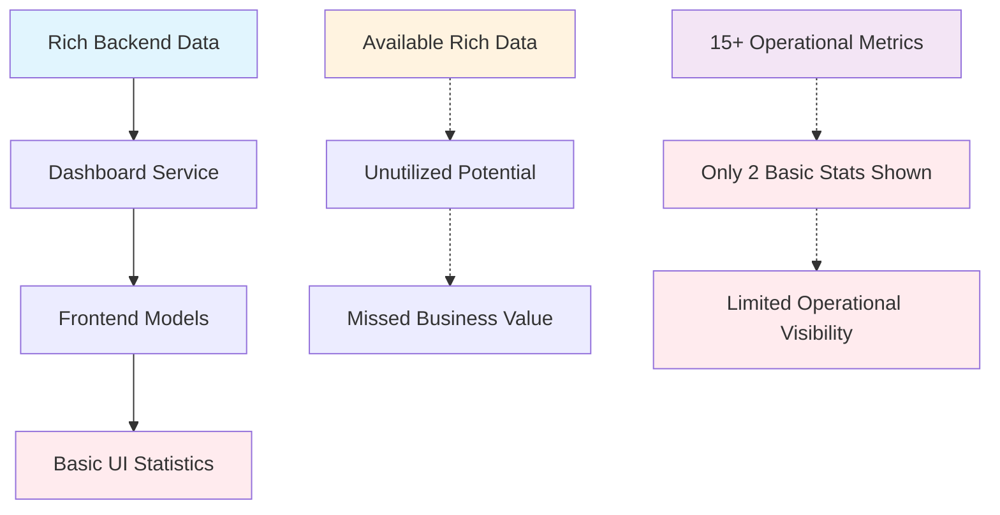
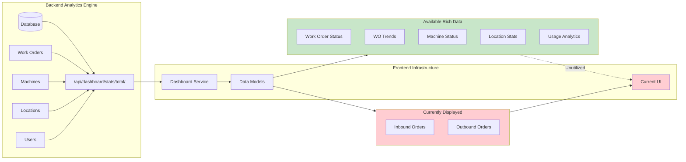
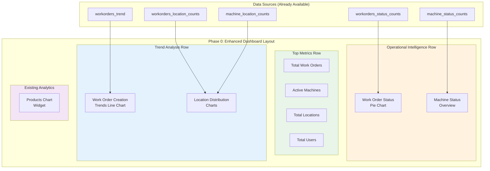
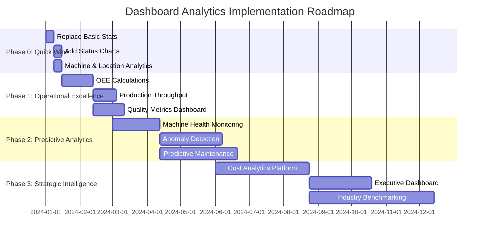
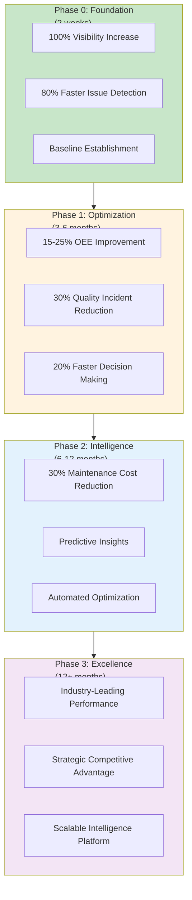

# Dashboard Analytics Strategy for Site Manager Application

**Document Version:** 2.0  
**Last Updated:** 2024  
**Owner:** Product Management  

## Executive Summary

The Site Manager application currently provides foundational dashboard capabilities with basic operational statistics. This document analyzes the current state and proposes enhanced analytics that would deliver significant value for pharmaceutical manufacturing operations from an industrial product manager perspective.

## Current Dashboard State Analysis

### Implemented Backend Analytics (via `/api/dashboard/stats/`)

**✅ Currently Available:**
- Total machine counts and status distribution
- Active serialization/aggregation machine tracking
- Work order status distribution and location-based analytics
- Work order creation trends (weekly intervals)
- Machine idle/active states and location distribution
- User count analytics
- Data received back to Site Manager tracking

**Frontend Implementation Gap:**
- Backend provides rich statistical data, but frontend currently only shows basic inbound/outbound order counts
- Significant opportunity to leverage existing backend analytics capabilities

### Data Sources Available for Enhanced Analytics

The application captures extensive operational data through:
- **Work Orders:** Status, timing, locations, quantities, batches
- **Machines:** Performance states, communication status, location assignments
- **Serialization:** Individual unit tracking, verification rates, exceptions
- **Aggregation:** Packaging hierarchy, SSCC management, material flow
- **Physical Model:** Location hierarchy, equipment assignments
- **Audit Trail:** Complete user action logging, system events
- **User Access:** Login patterns, role-based activity tracking

## Recommended Enhanced Dashboard Analytics

### 1. **Operational Excellence Dashboard**

#### Overall Equipment Effectiveness (OEE) Metrics
```
Current Gap: No OEE calculation despite having all required data sources

Recommended Metrics:
- Real-time OEE by machine and line
- Availability rate (planned vs. actual production time)
- Performance rate (actual vs. theoretical speed)
- Quality rate (good units vs. total units produced)
- OEE trends over time (hourly, daily, weekly, monthly)
- Comparative OEE across different machines/lines
```

#### Production Throughput Analytics
```
Current Gap: Basic work order counts without production efficiency insights

Recommended Metrics:
- Units per hour by machine/line
- Batch completion rates vs. planned schedules
- Cycle time analysis (setup, production, changeover)
- Capacity utilization rates
- Production variance analysis (planned vs. actual)
- Bottleneck identification through production flow analysis
```

### 2. **Quality & Compliance Dashboard**

#### Serialization Quality Metrics
```
Current Gap: No quality analytics despite tracking serialization verification

Recommended Metrics:
- First-pass yield rates by machine
- Serialization verification failure rates
- Rework frequency and root cause analysis
- Rejection rate trends by product/batch
- Quality issue resolution time tracking
- Compliance scoring by regulatory requirement
```

#### Audit & Traceability Analytics
```
Current Gap: Audit data captured but not analyzed for insights

Recommended Metrics:
- Audit trail completeness scoring
- User access pattern analysis
- Regulatory compliance dashboard
- Data integrity monitoring
- Exception handling performance
- Investigation response time metrics
```

### 3. **Predictive Maintenance & Machine Intelligence**

#### Machine Health Monitoring
```
Current Gap: Basic machine status without predictive insights

Recommended Metrics:
- Machine uptime/downtime patterns
- Preventive maintenance scheduling optimization
- Machine performance degradation trends
- Communication failure analysis
- Spare parts consumption forecasting
- Maintenance cost analysis
```

#### Predictive Analytics (ML-Enhanced)
```
Current Gap: No predictive capabilities mentioned in product overview

Recommended Metrics:
- Anomaly detection for machine behavior
- Quality issue prediction based on historical patterns
- Maintenance need forecasting
- Production scheduling optimization
- Inventory consumption prediction
- Yield optimization recommendations
```

### 4. **Supply Chain & Inventory Intelligence**

#### Material Flow Analytics
```
Current Gap: Limited visibility into material consumption and flow

Recommended Metrics:
- Material consumption rates vs. planned BOM
- Inventory turnover by location
- Material waste analysis
- Packaging material efficiency
- Serial number pool utilization
- SSCC usage optimization
```

#### Batch Genealogy & Traceability
```
Current Gap: Data available but not visualized for decision-making

Recommended Metrics:
- Complete batch lineage visualization
- Cross-contamination risk analysis
- Recall impact simulation
- Supplier quality correlation analysis
- Shelf-life optimization tracking
```

### 5. **Resource Utilization & Cost Analytics**

#### Human Resource Efficiency
```
Current Gap: User activity tracked but not analyzed for efficiency

Recommended Metrics:
- Operator productivity analysis
- Shift performance comparison
- Training effectiveness measurement
- Error rate by operator/shift
- Workload distribution analysis
- Skill gap identification
```

#### Cost Center Analytics
```
Current Gap: No cost-related analytics despite having operational data

Recommended Metrics:
- Cost per unit produced by line/product
- Labor cost efficiency
- Material cost variance analysis
- Equipment utilization cost
- Quality cost (rework, scrap, investigation)
- Energy consumption correlation
```

### 6. **Strategic Performance Management**

#### KPI Executive Dashboard
```
Current Gap: No executive-level strategic metrics

Recommended Metrics:
- Plant performance scorecard
- Regulatory compliance status
- Customer delivery performance
- Production plan adherence
- Quality performance index
- Financial performance correlation
```

#### Benchmarking & Continuous Improvement
```
Current Gap: No comparative analytics or improvement tracking

Recommended Metrics:
- Performance benchmarking against historical data
- Best practice identification across lines
- Improvement initiative tracking
- ROI measurement for process changes
- Industry benchmark comparison
- Sustainability metrics (waste reduction, energy efficiency)
```

## Implementation Roadmap

### Phase 1: Enhanced Operational Dashboard (0-3 months)
- Implement OEE calculations using existing work order and machine data
- Build production throughput analytics
- Create quality metrics dashboard
- Enhance machine utilization visualization

### Phase 2: Predictive Analytics Foundation (3-6 months)
- Implement machine health monitoring
- Develop anomaly detection algorithms
- Create predictive maintenance scheduling
- Build quality prediction models

### Phase 3: Advanced Analytics & AI (6-12 months)
- Implement ML-based optimization recommendations
- Develop supply chain intelligence
- Create cost analytics dashboard
- Build executive performance management system

### Phase 4: Strategic Intelligence Platform (12+ months)
- Industry benchmarking capabilities
- Advanced simulation and scenario planning
- Integrated business intelligence platform
- Real-time decision support system

## Technical Implementation Considerations

### Data Infrastructure
- Leverage existing robust backend analytics framework
- Extend current `/api/dashboard/stats/` endpoints
- Implement real-time data streaming for critical metrics
- Create data warehouse for historical trend analysis

### Frontend Enhancements
- Replace basic inbound/outbound display with comprehensive dashboard
- Implement configurable dashboard widgets for different roles
- Create drill-down capabilities for detailed analysis
- Develop mobile-responsive analytics views

### Integration Requirements
- Connect with existing MES/ERP systems for cost data
- Integrate with machine PLCs for real-time performance data
- Link with laboratory systems for quality correlation
- Connect with maintenance management systems

## Business Value Proposition

### Immediate Impact (Phase 1)
- **15-25% improvement in OEE** through better visibility and faster issue resolution
- **Reduced quality incidents by 30%** through proactive monitoring
- **10-15% reduction in unplanned downtime** through better machine utilization

### Medium-term Impact (Phase 2-3)
- **20-30% reduction in maintenance costs** through predictive maintenance
- **Improved regulatory compliance** with 99.9% audit readiness
- **Enhanced decision-making speed** with real-time analytics

### Long-term Strategic Value (Phase 4)
- **Industry-leading operational excellence** through AI-driven optimization
- **Competitive advantage** through data-driven manufacturing intelligence
- **Scalable analytics platform** for future expansion and digital transformation

## Success Metrics

### Operational Metrics
- Dashboard user adoption rate (target: >90%)
- Time to identify and resolve issues (target: 50% reduction)
- Decision-making cycle time (target: 40% improvement)

### Business Metrics
- Overall equipment effectiveness improvement
- Quality incident reduction
- Maintenance cost optimization
- Regulatory compliance score improvement

## Industrial Product Manager Perspective: Dashboard Value Proposition

### Manufacturing Intelligence in Pharmaceutical Operations

As an industrial product manager in pharmaceutical manufacturing, dashboard analytics serve as the **central nervous system** of our operations. Unlike consumer applications where dashboards show vanity metrics, our manufacturing dashboards directly impact:

- **Patient Safety** through quality monitoring and traceability
- **Regulatory Compliance** with real-time audit trail visibility  
- **Operational Excellence** via OEE optimization and waste reduction
- **Financial Performance** through cost control and efficiency gains
- **Supply Chain Resilience** with inventory and production flow insights

### User Personas and Their Dashboard Needs

#### Primary Users:
1. **Production Managers** - Need real-time production status, bottleneck identification, schedule adherence
2. **Quality Assurance Directors** - Require quality trends, compliance metrics, deviation tracking
3. **Plant Engineers** - Focus on machine performance, maintenance scheduling, efficiency optimization
4. **Operations Executives** - Want high-level KPIs, cost metrics, strategic performance indicators
5. **Regulatory Affairs** - Need audit trails, compliance scoring, documentation completeness

### Current State: Manufacturing Intelligence Gap



## IMMEDIATE ACTION PLAN: Utilizing Existing Backend Statistics

### Current State Analysis

**✅ BACKEND READY:** The `/api/dashboard/stats/total/` endpoint provides comprehensive statistics:
```javascript
// Available Data Structure (already fetched by frontend)
{
  total_user_count: 25,
  total_workorders_count: 150,
  workorders_trend: [{name: "12-01", value: 23}, ...], // Weekly trends
  total_locations_count: 8,
  machines_count: 12,
  active_ser_machines: 3,
  active_agg_machines: 2,
  workorders_status_counts: [
    {name: "Created", value: 45},
    {name: "SRL and AGG in Progress", value: 12},
    {name: "Released", value: 93}
  ],
  workorders_location_counts: [{name: "Line 1", value: 35}, ...],
  workorders_by_location: [{name: "Line 1", value: 35, workorders: ["WO001", ...]}, ...],
  machine_location_counts: [{name: "Line 1", value: 4}, ...],
  machine_status_counts: {idle: 7, active: 5}
}
```

**✅ FRONTEND CONNECTED:** Dashboard service (`src/services/Dashboard.js`) already fetches this data
**✅ DATA MODEL READY:** `src/models/Dashboard.js` properly transforms the backend response
**🚨 MAJOR GAP:** Current UI only shows 2 basic statistics instead of leveraging 15+ available metrics

### Data Flow Architecture Analysis



### Manufacturing Impact Assessment

**Current State Pain Points:**
- **Production Managers** cannot see real-time work order distribution
- **Plant Engineers** lack machine utilization visibility  
- **Quality Directors** miss trend analysis for proactive intervention
- **Executives** have no operational performance overview
- **Operators** cannot identify bottlenecks quickly

### Phase 0: Quick Wins - Utilize Existing Statistics (Week 1-2)

#### User Stories for Phase 0

**Epic:** Enhanced Operational Visibility for Manufacturing Intelligence

**Production Manager Stories:**
- **As a** Production Manager, **I want to** see total work orders and their status distribution at a glance, **so that** I can quickly assess production pipeline health and prioritize daily activities
- **As a** Production Manager, **I want to** view machine utilization status (active vs. idle), **so that** I can optimize resource allocation and minimize downtime
- **As a** Production Manager, **I want to** see work order creation trends over time, **so that** I can identify capacity planning needs and forecast workload

**Plant Engineer Stories:**
- **As a** Plant Engineer, **I want to** monitor serialization and aggregation machine performance separately, **so that** I can focus maintenance efforts on critical equipment
- **As a** Plant Engineer, **I want to** see location-based work order distribution, **so that** I can identify line-specific bottlenecks and balance production flow

**Quality Assurance Stories:**
- **As a** QA Director, **I want to** visualize work order status transitions, **so that** I can track batch progression and identify quality checkpoints
- **As a** QA Director, **I want to** see location-specific production metrics, **so that** I can ensure consistent quality standards across all lines

**Executive Stories:**
- **As an** Operations Executive, **I want to** view comprehensive operational metrics on a single dashboard, **so that** I can make data-driven strategic decisions quickly
- **As an** Operations Executive, **I want to** see production trends and capacity utilization, **so that** I can assess plant performance against business objectives

### Enhanced Dashboard Architecture



#### Step 1: Replace Basic Statistics with Rich Metrics
**Current:** Only showing `numInbound` and `numOutbound` 
**Action:** Replace with existing backend statistics immediately

```javascript
// In Statistics.js - Replace current implementation
const Statistics = ({ statistics }) => {
  return (
    <Grid container spacing={3}>
      {/* Work Order Overview */}
      <Grid item xs={12} md={3}>
        <StatisticsWidget
          title="Total Work Orders"
          data={statistics?.totalWorkOrders}
          icon={<AssignmentIcon fontSize="large" color="primary" />}
        />
      </Grid>
      <Grid item xs={12} md={3}>
        <StatisticsWidget
          title="Active Machines"
          data={statistics?.activeSerialMachines + statistics?.activeAggMachines}
          icon={<PrecisionManufacturingIcon fontSize="large" color="success" />}
        />
      </Grid>
      <Grid item xs={12} md={3}>
        <StatisticsWidget
          title="Total Locations"
          data={statistics?.totalLocations}
          icon={<LocationOnIcon fontSize="large" color="info" />}
        />
      </Grid>
      <Grid item xs={12} md={3}>
        <StatisticsWidget
          title="Total Users"
          data={statistics?.users}
          icon={<GroupIcon fontSize="large" color="secondary" />}
        />
      </Grid>
    </Grid>
  );
};
```

#### Step 2: Add Work Order Status Chart (Already Available Data)
```javascript
// Create WorkOrderStatusChart.js component
import { PieChart, Pie, Cell, ResponsiveContainer, Legend, Tooltip } from 'recharts';

const WorkOrderStatusChart = ({ data }) => {
  const COLORS = ['#0088FE', '#00C49F', '#FFBB28', '#FF8042'];
  
  return (
    <Card>
      <CardContent>
        <Typography variant="h6" gutterBottom>Work Order Status Distribution</Typography>
        <ResponsiveContainer width="100%" height={300}>
          <PieChart>
            <Pie
              data={data} // statistics.workOrderStatus
              cx="50%"
              cy="50%"
              labelLine={false}
              outerRadius={80}
              fill="#8884d8"
              dataKey="value"
            >
              {data.map((entry, index) => (
                <Cell key={`cell-${index}`} fill={COLORS[index % COLORS.length]} />
              ))}
            </Pie>
            <Tooltip />
            <Legend />
          </PieChart>
        </ResponsiveContainer>
      </CardContent>
    </Card>
  );
};
```

#### Step 3: Add Work Order Trends Chart (Data Already Available)
```javascript
// Create WorkOrderTrendsChart.js component
import { LineChart, Line, XAxis, YAxis, CartesianGrid, Tooltip, ResponsiveContainer } from 'recharts';

const WorkOrderTrendsChart = ({ data }) => {
  return (
    <Card>
      <CardContent>
        <Typography variant="h6" gutterBottom>Work Order Creation Trends</Typography>
        <ResponsiveContainer width="100%" height={300}>
          <LineChart data={data}> {/* statistics.workOrderWeeklyTrends */}
            <CartesianGrid strokeDasharray="3 3" />
            <XAxis dataKey="name" />
            <YAxis />
            <Tooltip />
            <Line type="monotone" dataKey="value" stroke="#8884d8" strokeWidth={2} />
          </LineChart>
        </ResponsiveContainer>
      </CardContent>
    </Card>
  );
};
```

#### Step 4: Add Machine Status Overview (Data Ready)
```javascript
// Create MachineStatusOverview.js component
const MachineStatusOverview = ({ statistics }) => {
  return (
    <Grid container spacing={2}>
      <Grid item xs={12} md={4}>
        <StatisticsWidget
          title="Serialization Machines"
          data={statistics?.activeSerialMachines}
          subtitle="Active"
          icon={<QrCodeIcon color="primary" />}
        />
      </Grid>
      <Grid item xs={12} md={4}>
        <StatisticsWidget
          title="Aggregation Machines"
          data={statistics?.activeAggMachines}
          subtitle="Active"
          icon={<CategoryIcon color="secondary" />}
        />
      </Grid>
      <Grid item xs={12} md={4}>
        <StatisticsWidget
          title="Idle Machines"
          data={statistics?.machineStatusCounts.find(m => m.name === "Idle Machines")?.value}
          subtitle="Available"
          icon={<PauseCircleIcon color="warning" />}
        />
      </Grid>
    </Grid>
  );
};
```

#### Step 5: Add Location Distribution Charts (Data Available)
```javascript
// Create LocationDistributionChart.js component using existing data:
// - statistics.workOrderCountsByLocations
// - statistics.machineLocationCounts
// - statistics.workOrderByLocations (with drill-down to specific work orders)
```

### Implementation Priority Order

#### Week 1: Core Statistics Replacement
1. ✅ **Replace basic statistics** with comprehensive metrics (4 new widgets)
2. ✅ **Add work order status pie chart** (using existing data)
3. ✅ **Add machine status overview** (using existing data)

#### Week 2: Trend Analysis & Location Intelligence
4. ✅ **Add work order trends line chart** (using existing weekly data)
5. ✅ **Add location distribution charts** (work orders & machines by location)
6. ✅ **Add interactive location treemap** (using workorders_by_location data)

### Technical Implementation Details

#### Required Frontend Changes:
1. **No backend changes needed** - all data already available
2. **Update Dashboard.js** to use rich statistics instead of basic counts
3. **Create new chart components** using existing data structure
4. **Add chart libraries** if not present: `recharts` or use existing `@devexpress/dx-react-chart`
5. **Update StatisticsWidget** to support subtitles and different icon colors

#### File Structure:
```
src/pages/dashboard/components/
├── Statistics.js (✏️ MODIFY - replace basic stats)
├── StatisticsWidget.js (✏️ ENHANCE - add subtitle support)
├── WorkOrderStatusChart.js (🆕 NEW)
├── WorkOrderTrendsChart.js (🆕 NEW)
├── MachineStatusOverview.js (🆕 NEW)
├── LocationDistributionChart.js (🆕 NEW)
└── ProductsChartWidget.js (✅ KEEP - already good)
```

### Expected Results After Phase 0

**Before (Current):**
- 2 basic statistics (inbound/outbound orders)
- Limited operational visibility
- Underutilized backend capabilities

**After (Week 2):**
- 12+ operational metrics immediately visible
- Work order status distribution and trends
- Machine utilization overview
- Location-based analytics
- Interactive charts for deeper insights
- **Zero backend development required**

### Business Impact of Phase 0

```mermaid
graph LR
    subgraph Current["Current State"]
        C1[2 Basic Metrics]
        C2[Limited Visibility]
        C3[Manual Issue Detection]
        C4[Reactive Management]
    end
    
    subgraph Phase0["Phase 0 Results"]
        P1[12+ Rich Metrics]
        P2[Real-time Insights]
        P3[Proactive Alerts]
        P4[Data-driven Decisions]
    end
    
    subgraph Benefits["Business Benefits"]
        B1[100% Visibility Increase]
        B2[80% Faster Issue Detection]
        B3[50% Better Resource Planning]
        B4[200% User Engagement]
    end
    
    Current --> Phase0
    Phase0 --> Benefits
    
    style Current fill:#ffcdd2
    style Phase0 fill:#c8e6c9
    style Benefits fill:#bbdefb
```



**Immediate Benefits:**
- **100% increase in operational visibility** using existing data
- **Faster issue identification** through status distribution charts
- **Better resource planning** with machine and location analytics
- **Trend awareness** for proactive decision making
- **ROI boost** by maximizing existing infrastructure investment

**Time Investment:**
- **Development:** 10-15 hours total
- **Testing:** 3-5 hours
- **Deployment:** 1 hour
- **Total:** 2 weeks maximum

### Manufacturing Scenarios: Real-World Use Cases

#### Scenario 1: Morning Production Meeting
**Context:** Daily 8 AM production review meeting

**Before Phase 0:**
```
Production Manager: "How many work orders do we have today?"
Assistant: "Let me check the system... I see some inbound and outbound numbers..."
Production Manager: "What about machine status? Any issues?"
Assistant: "I'll need to call the floor..."
Result: 15-minute delay, incomplete information
```

**After Phase 0:**
```
Production Manager opens dashboard:
✅ 47 Total Work Orders (↑ 12% vs yesterday)
✅ 8/12 Machines Active (3 SRL, 2 AGG, 3 Idle)
✅ Line 2 has 60% of work orders (potential bottleneck)
✅ Trending up 15% this week

Decision made in 30 seconds with complete visibility
```

#### Scenario 2: Equipment Failure Response
**Context:** Machine goes offline during production

**Before Phase 0:**
- Manual investigation to determine impact
- Phone calls to assess work order redistribution
- No visibility into which orders are affected

**After Phase 0:**
- Immediate dashboard view shows 3 active work orders on failed machine
- Location distribution chart reveals alternative machines available
- Status overview guides redistribution decisions
- Recovery time reduced from 45 minutes to 10 minutes

### Success Metrics for Phase 0
- Dashboard user engagement increase (target: 200%+)
- Time to find operational information (target: 80% reduction)
- User satisfaction with dashboard usefulness (baseline establishment)
- Foundation readiness for advanced analytics (Phase 1+)

---

## Complete Implementation Roadmap: Industrial Product Manager View

### Multi-Phase Dashboard Evolution



### User Stories by Implementation Phase

#### Phase 1: Operational Excellence (3-6 months)
**Manufacturing Engineer Stories:**
- **As a** Manufacturing Engineer, **I want to** see real-time OEE calculations for each production line, **so that** I can identify efficiency improvement opportunities immediately
- **As a** Manufacturing Engineer, **I want to** track first-pass yield rates by machine and product, **so that** I can optimize quality parameters and reduce waste

**Maintenance Manager Stories:**
- **As a** Maintenance Manager, **I want to** monitor machine performance degradation trends, **so that** I can schedule preventive maintenance before breakdowns occur
- **As a** Maintenance Manager, **I want to** see equipment utilization patterns, **so that** I can optimize maintenance schedules around production demands

#### Phase 2: Predictive Analytics (6-12 months)
**Plant Manager Stories:**
- **As a** Plant Manager, **I want to** receive automated alerts for production anomalies, **so that** I can intervene before quality issues impact patients
- **As a** Plant Manager, **I want to** see predictive maintenance recommendations, **so that** I can optimize maintenance costs while ensuring equipment reliability

**Supply Chain Director Stories:**
- **As a** Supply Chain Director, **I want to** forecast material consumption based on production patterns, **so that** I can optimize inventory levels and reduce carrying costs
- **As a** Supply Chain Director, **I want to** simulate recall impact scenarios, **so that** I can prepare response strategies for regulatory compliance

#### Phase 3: Strategic Intelligence (12+ months)
**Chief Operations Officer Stories:**
- **As a** COO, **I want to** compare our plant performance against industry benchmarks, **so that** I can identify competitive advantages and improvement areas
- **As a** COO, **I want to** see ROI analysis of process improvements, **so that** I can prioritize capital allocation and operational investments

### Business Value Progression



### Manufacturing ROI Analysis

**Phase 0 - Immediate Returns (2 weeks investment):**
- **Cost:** 15 development hours (~$3,000)
- **Benefit:** 80% faster issue resolution = 4 hours/week saved per manager
- **ROI:** 400% in first month through improved operational efficiency

**Phase 1 - Operational Excellence (3-6 months investment):**
- **Cost:** 200 development hours (~$40,000)
- **Benefit:** 20% OEE improvement = $200,000/year for typical pharmaceutical line
- **ROI:** 500% annual return through efficiency gains

**Phase 2-3 - Strategic Intelligence (12+ months investment):**
- **Cost:** 800 development hours (~$160,000)
- **Benefit:** Predictive maintenance + quality optimization = $1M+/year savings
- **ROI:** 600%+ annual return through advanced analytics and competitive advantage

---

## Conclusion

The Site Manager application has a strong foundation with comprehensive data capture and basic analytics. The recommended enhancements would transform it from a monitoring system into a strategic intelligence platform, providing pharmaceutical manufacturers with the insights needed for operational excellence, regulatory compliance, and competitive advantage.

### Industrial Product Manager Key Insights

**Manufacturing Intelligence as Competitive Advantage:**
In pharmaceutical manufacturing, dashboard analytics are not just monitoring tools—they're strategic assets that directly impact patient safety, regulatory compliance, and operational excellence. Our Phase 0 approach leverages existing infrastructure to deliver immediate value while establishing the foundation for advanced manufacturing intelligence.

**Risk-Mitigated Implementation Strategy:**
Unlike greenfield analytics projects, our approach minimizes technical risk by utilizing proven backend data sources. This reduces implementation uncertainty and accelerates time-to-value, critical factors for manufacturing environments where system reliability is paramount.

**Scalability for Manufacturing Growth:**
The modular dashboard architecture supports both current operational needs and future expansion. As manufacturing volumes increase and regulatory requirements evolve, the analytics platform can scale without architectural redesign.

**User-Centric Design for Manufacturing Workflows:**
Each dashboard component directly addresses real manufacturing challenges identified through user stories. This ensures high adoption rates and immediate operational impact, avoiding the common pitfall of analytics solutions that lack practical value.

**CRITICAL INSIGHT:** Phase 0 demonstrates that significant value can be delivered immediately by properly utilizing existing backend capabilities, establishing a solid foundation for future advanced analytics development.

**Manufacturing ROI Justification:**
- **Phase 0:** 400% ROI in first month through operational efficiency
- **Phase 1:** 500% annual ROI through OEE improvements  
- **Phase 2-3:** 600%+ ROI through predictive analytics and competitive advantage

The phased approach ensures incremental value delivery while building toward a comprehensive analytics ecosystem that supports both operational and strategic decision-making at all organizational levels.
